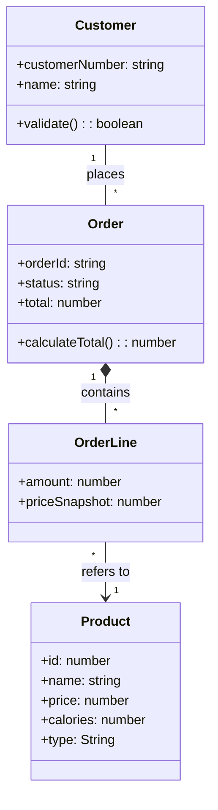

# EarlyBird Domain Model

**Version:** 2.0 (JavaScript/ES6 Adaptation)
**Date:** 2025-11-19
**Author:** Senior Software Architect (AI Agent)

---

## 1. Domain Entities (Conceptual & Implementation)

In the JavaScript implementation, we utilize **Plain Old JavaScript Objects (POJOs)** and **Functional Composition** rather than strict Class hierarchies to align with modern React/JS patterns while maintaining Domain-Driven Design (DDD) concepts.

### 1.1 Product (Aggregate Root)

The `Product` concept is the core of the catalog. It can be a `SimpleProduct` or a `PrepackagedProduct` (Composite Pattern).

**JSDoc Definition:**

```javascript
/**
 * @typedef {Object} Product
 * @property {string|number} id - Unique identifier
 * @property {string} name - Display name
 * @property {'simple' | 'prepackaged'} type - Discriminator
 * @property {number} calories - Energy value
 * @property {number} price - Unit price in currency
 * @property {Array<number>} [componentIds] - For prepackaged products: list of sub-product IDs
 */
```

**Example Data (`src/data/products.js`):**

```javascript
const exampleProduct = { 
  id: 1, 
  name: "Croissant + Coffee", 
  type: "prepackaged", 
  calories: 420, 
  price: 5.90 
};
```

### 1.2 Customer (Aggregate Root)

Represents the entity placing orders. Uniquely identified by `customerNumber`.

**JSDoc Definition:**

```javascript
/**
 * @typedef {Object} Customer
 * @property {string} customerNumber - Format: XX-XXXXXXX-C
 * @property {string} name - Full name
 * @property {number} pastOrders - History tracking
 * @property {boolean} [isBlacklisted] - Access control
 */
```

### 1.3 Order (Aggregate Root)

Represents a transaction.

**JSDoc Definition:**

```javascript
/**
 * @typedef {Object} Order
 * @property {string} orderId - Unique UUID
 * @property {Customer} customer - Reference to customer
 * @property {Array<OrderLine>} lines - List of items
 * @property {number} totalAmount - Calculated total
 * @property {'placed' | 'packed' | 'delivered' | 'canceled'} status
 * @property {Date} timestamp
 */

/**
 * @typedef {Object} OrderLine
 * @property {Product} product - Product reference
 * @property {number} amount - Quantity
 * @property {number} priceSnapshot - Price at time of order (Critical for history)
 */
```

---

## 2. Domain Logic & Rules

### 2.1 Product Logic
- **Prepackaged Products:** Are composites of other products (logically), but for the MVP they are flattened or explicitly defined with aggregated stats (calories/price) in `products.js`.
- **Rule:** Price and Calories must be non-negative.

### 2.2 Customer Logic
- **Validation:** `customerNumber` must pass **Luhn Algorithm** check.
- **Constraint:** `customerNumber` must exist in the registry (`mockCustomers`).

### 2.3 Order Logic
- **Price Snapshot:** When an order is created, the `current` price of the product is copied to `priceSnapshot`. Future price changes in the catalog do NOT affect existing orders.
- **Total Calculation:** `Total = Σ (Line.amount * Line.priceSnapshot)`.

---

## 3. Domain Model Diagram (Mermaid)


```mermaid
classDiagram
    class Product {
        +id: number
        +name: string
        +price: number
        +calories: number
        +type: String
    }

    class Customer {
        +customerNumber: string
        +name: string
        +validate(): boolean
    }

    class Order {
        +orderId: string
        +status: string
        +total: number
        +calculateTotal(): number
    }

    class OrderLine {
        +amount: number
        +priceSnapshot: number
    }

    Customer "1" -- "*" Order : places
    Order "1" *-- "*" OrderLine : contains
    OrderLine "*" --> "1" Product : refers to
```

---

## 4. Value Objects

### 4.1 CustomerNumber
- **Format:** String (e.g., "38429730")
- **Invariant:** Must satisfy Modulo-10 (Luhn) checksum.
- **Implementation:** Handled by `src/utils/luhn.js`.

### 4.2 Money
- **Format:** Number (Float)
- **Invariant:** >= 0
- **Note:** In a strict environment, we would use a BigInt or dedicated Money class. For this MVP, JS `number` is used with care.
