# EarlyBird Domain Model - Core Entities (TYPE A)

```mermaid
classDiagram
%% PRODUCT AGGREGATE
    class Product {
        <<AggregateRoot>>
        -String productCode
        -String name
        -String unit
        -Money pricePerUnit
        -Int calories
        -Set~Characteristic~ characteristics
        +calculateTotalPrice()* Money
        +calculateTotalCalories()* Int
        +matchesCharacteristics(criteria) Boolean
    }

    class SimpleProduct {
        <<Entity>>
        +calculateTotalPrice() Money
        +calculateTotalCalories() Int
    }

    class PrepackagedProduct {
        <<Entity>>
        -List~ProductComponent~ components
        +calculateTotalPrice() Money
        +calculateTotalCalories() Int
        +getComponents() List~ProductComponent~
    }

    class ProductComponent {
        <<Entity>>
        -Product product
        -Int amount
        +calculatePrice() Money
        +calculateCalories() Int
    }

%% CUSTOMER AGGREGATE
    class Customer {
        <<AggregateRoot>>
        -CustomerNumber customerNumber
        -String firstName
        -String surname
        -Address address
        -Password password
        -Boolean isBlacklisted
        -String blacklistReason
        +authenticate(password String) Boolean
        +blacklist(reason String) void
        +removeFromBlacklist() void
    }

    class CustomerNumber {
        <<ValueObject>>
        -String areaCode
        -String digits
        -Char checksum
        +parse(input String)$ CustomerNumber
        +validate() Boolean
        +toString() String
    }

    class Address {
        <<ValueObject>>
        -String street
        -String houseNumber
        -String zipCode
        -String city
        -String country
        +toString() String
    }

%% ORDER AGGREGATE
    class Order {
        <<AggregateRoot>>
        -OrderNumber orderNumber
        -Customer customer
        -OrderStatus status
        -List~OrderLine~ orderLines
        -Order blueprintOrder
        -DateTime placedAt
        -PackingClerk packedBy
        -DeliveryClerk deliveredBy
        +calculateTotal() Money
        +canCancel() Boolean
        +cancel() void
        +markPacked(clerk PackingClerk) void
        +markDelivered(clerk DeliveryClerk) void
        +getStatus() OrderStatus
    }

    class OrderLine {
        <<Entity>>
        -Product product
        -Int amount
        -Money priceSnapshot
        +calculateLineTotal() Money
    }

    class OrderStatus {
        <<Enumeration>>
        PLACED
        PACKED
        OUT_FOR_DELIVERY
        DELIVERED
        CANCELED
        +canTransitionTo(newStatus) Boolean
    }

    class OrderNumber {
        <<ValueObject>>
        -String digits
        -Char checksum
        +generate()$ OrderNumber
        +parse(input String)$ OrderNumber
        +validate() Boolean
        +toString() String
    }

%% INVOICE AGGREGATE
    class Invoice {
        <<AggregateRoot>>
        -InvoiceNumber invoiceNumber
        -Order order
        -Customer customer
        -List~InvoiceOrderLine~ orderLines
        -Money totalAmount
        -Int printedCopies
        -DateTime generatedAt
        +generateNextCopy() InvoiceCopy
        +getTotalAmount() Money
    }

    class InvoiceOrderLine {
        <<Entity>>
        -Product product
        -Int amount
        -Money pricePerUnit
        -Money lineTotal
        +calculateLineTotal() Money
    }

    class InvoiceNumber {
        <<ValueObject>>
        -Int number
        -OrderNumber generatedFrom
        +generate(order Order)$ InvoiceNumber
        +toString() String
    }

%% DELIVERY AGGREGATE
    class DeliveryRoute {
        <<AggregateRoot>>
        -RouteId routeId
        -DeliveryClerk deliveryClerk
        -List~Order~ orders
        -List~DeliveryStop~ optimizedStops
        -Distance totalDistance
        -Duration estimatedDuration
        -Int currentStopIndex
        +optimizeRoute() void
        +getCurrentStop() DeliveryStop
        +getNextStop() DeliveryStop
        +markStopCompleted() void
        +calculateETA(stop DeliveryStop) DateTime
    }

    class DeliveryStop {
        <<Entity>>
        -Order order
        -Customer customer
        -Address address
        -Int sequenceNumber
        -DateTime estimatedArrival
        -DateTime actualArrival
        +markDelivered(time DateTime) void
        +isCompleted() Boolean
    }

    class RouteId {
        <<ValueObject>>
        -String id
        -Date date
        +generate(date Date)$ RouteId
        +toString() String
    }

%% SHARED VALUE OBJECTS
    class Money {
        <<ValueObject>>
        -Decimal amount
        -Currency currency
        +add(other Money) Money
        +subtract(other Money) Money
        +multiply(factor Int) Money
        +ZERO$ Money
    }

    class Distance {
        <<ValueObject>>
        -Decimal kilometers
        +add(other Distance) Distance
        +toString() String
    }

    class Duration {
        <<ValueObject>>
        -Int minutes
        +add(other Duration) Duration
        +toString() String
    }

    class Currency {
        <<Enumeration>>
        EUR
        USD
        GBP
    }

%% PRODUCT AGGREGATE RELATIONSHIPS
    Product <|-- SimpleProduct: extends
    Product <|-- PrepackagedProduct: extends
    PrepackagedProduct *-- "many" ProductComponent: contains
    ProductComponent --> Product: references
%% CUSTOMER AGGREGATE RELATIONSHIPS
    Customer *-- "1" CustomerNumber: has
    Customer *-- "1" Address: lives at
%% ORDER AGGREGATE RELATIONSHIPS
    Order *-- "many" OrderLine: contains
    Order --> Customer: placed by
    Order --> Order: blueprint (optional)
    Order *-- "1" OrderStatus: has
    Order *-- "1" OrderNumber: identified by
    OrderLine --> Product: references
%% INVOICE AGGREGATE RELATIONSHIPS
    Invoice *-- "many" InvoiceOrderLine: contains
    Invoice --> Order: for
    Invoice --> Customer: billed to
    Invoice *-- "1" InvoiceNumber: identified by
    InvoiceOrderLine --> Product: references
%% DELIVERY AGGREGATE RELATIONSHIPS
    DeliveryRoute *-- "many" DeliveryStop: has
    DeliveryRoute *-- "1" RouteId: identified by
    DeliveryStop --> Order: delivers
    DeliveryStop --> Customer: to
    DeliveryStop --> Address: at
%% VALUE OBJECT USAGE
    Money --> Currency: uses
    Product --> Money: pricePerUnit
    OrderLine --> Money: priceSnapshot
    InvoiceOrderLine --> Money: pricePerUnit, lineTotal
    Invoice --> Money: totalAmount
    DeliveryRoute --> Distance: totalDistance
    DeliveryRoute --> Duration: estimatedDuration
    note for Product "COMPOSITE PATTERN\nPrepackagedProduct can contain\nSimpleProducts AND other\nPrepackagedProducts!\n\nExample: Luxury Breakfast\n- SimpleProduct: Croissant\n- SimpleProduct: Orange Juice\n- PrepackagedProduct: Jam Selection\n  - SimpleProduct: Strawberry Jam\n  - SimpleProduct: Marmalade"
```



---

## Aggregate Roots and Business Rules

### 1. Product Aggregate

**Aggregate Root:** Product

**Entities:**

- SimpleProduct (leaf in composite)
- PrepackagedProduct (composite)
- ProductComponent (component reference with amount)

**Pattern:** Composite Pattern

- PrepackagedProduct can contain SimpleProducts AND other PrepackagedProducts
- Recursive composition allows nested packages (e.g., "Luxury Breakfast" contains "Jam Selection" which contains
  individual jams)

**Business Rules:**

```
Product.calculateTotalPrice():
  - SimpleProduct: return pricePerUnit
  - PrepackagedProduct: return SUM(component.calculatePrice() for each component)

Product.calculateTotalCalories():
  - SimpleProduct: return calories
  - PrepackagedProduct: return SUM(component.calculateCalories() for each component)

Product.matchesCharacteristics(criteria):
  - Check if all required characteristics are present
  - Used for product search (e.g., "vegetarian, low-calorie")
```

**Example:**

```
PrepackagedProduct: "Luxury Breakfast" (€15.00)
  └─ ProductComponent: Croissant × 2 (€3.00)
  └─ ProductComponent: Orange Juice × 1 (€2.50)
  └─ ProductComponent: "Jam Selection" × 1 (€6.50)
      └─ ProductComponent: Strawberry Jam × 1 (€3.00)
      └─ ProductComponent: Marmalade × 1 (€3.50)

Total Price: €15.00
Total Calories: Croissant.calories × 2 + OJ.calories + Jam.calories × 2
```

---

### 2. Customer Aggregate

**Aggregate Root:** Customer

**Value Objects:**

- CustomerNumber (XX-XXXXXXX-C format with checksum)
- Address (full postal address)
- Password (hashed, never stored in plain text)

**Business Rules:**

```
Customer.authenticate(password):
  - Hash provided password
  - Compare with stored password hash
  - Return true if match, false otherwise

Customer.blacklist(reason):
  - Set isBlacklisted = true
  - Store reason (e.g., "Repeated non-payment")
  - Blacklisted customers cannot place orders

Customer.removeFromBlacklist():
  - Set isBlacklisted = false
  - Clear blacklistReason
  - Customer can place orders again
```

**CustomerNumber Format:**

```
Format: XX-XXXXXXX-C
  XX = area code (2 digits)
  XXXXXXX = unique number (7 digits)
  C = checksum (1 digit, Luhn algorithm)

Example: 23-3911004-5

Validation:
  - Must match format
  - Checksum must be valid
  - Used to detect typos in customer entry
```

---

### 3. Order Aggregate

**Aggregate Root:** Order

**Entities:**

- OrderLine (line item with product, amount, price snapshot)

**Value Objects:**

- OrderNumber (XXXXXXXX-C format with checksum)
- OrderStatus (state machine)

**Business Rules:**

```
Order.calculateTotal():
  return SUM(orderLine.priceSnapshot × orderLine.amount for each orderLine)

Order.canCancel():
  return status == PLACED
  // Only orders not yet packed can be cancelled

Order.cancel():
  if not canCancel():
    throw BusinessRuleViolation("Cannot cancel order in status " + status)
  status = CANCELED

Order.markPacked(clerk):
  if status != PLACED:
    throw BusinessRuleViolation("Can only pack PLACED orders")
  status = PACKED
  packedBy = clerk

Order.markDelivered(clerk):
  if status != OUT_FOR_DELIVERY:
    throw BusinessRuleViolation("Can only deliver OUT_FOR_DELIVERY orders")
  status = DELIVERED
  deliveredBy = clerk
```

**CRITICAL: Price Snapshot Pattern**

**Problem:** Product prices may change after order is placed, but order total must remain constant!

**Solution:** Store price snapshot in OrderLine

```
When order is placed:
  orderLine.priceSnapshot = product.pricePerUnit

When order total is calculated (later):
  use orderLine.priceSnapshot (NOT current product.pricePerUnit)
```

**Example:**

```
Time T0 (Order Placed):
  Product "Coffee" pricePerUnit = €2.50
  OrderLine: product=Coffee, amount=2, priceSnapshot=€2.50
  Order total = €2.50 × 2 = €5.00

Time T1 (Price Changes):
  Product "Coffee" pricePerUnit = €3.00 (price increased!)

Time T2 (Order Delivered):
  Order total still = orderLine.priceSnapshot × amount = €2.50 × 2 = €5.00
  (NOT affected by price change!)
```

---

### 4. Invoice Aggregate

**Aggregate Root:** Invoice

**Entities:**

- InvoiceOrderLine (mirrors OrderLine with final prices)

**Value Objects:**

- InvoiceNumber (derived from OrderNumber)

**Business Rules:**

```
Invoice.generateNextCopy():
  // Invoices can be printed multiple times
  // Each copy gets unique InvoiceNumber variant
  printedCopies++
  return InvoiceCopy(invoiceNumber + "-" + printedCopies)

Invoice.getTotalAmount():
  return totalAmount (calculated when invoice created)
```

**Invoice Generation:**

```
When Order is packed:
  invoice = new Invoice()
  invoice.order = order
  invoice.customer = order.customer
  invoice.totalAmount = order.calculateTotal()

  for each orderLine in order.orderLines:
    invoiceOrderLine = new InvoiceOrderLine()
    invoiceOrderLine.product = orderLine.product
    invoiceOrderLine.amount = orderLine.amount
    invoiceOrderLine.pricePerUnit = orderLine.priceSnapshot
    invoiceOrderLine.lineTotal = orderLine.calculateLineTotal()
    invoice.orderLines.add(invoiceOrderLine)

  invoice.generatedAt = now()
  return invoice
```

**Example:**

```
Order 26127385-3:
  - Coffee × 2 @ €2.50 = €5.00
  - Toast × 1 @ €1.50 = €1.50
  Total: €6.50

Invoice 001-26127385-3 (first copy):
  Order: 26127385-3
  Customer: 23-3911004-5
  Lines:
    - Coffee × 2 @ €2.50 = €5.00
    - Toast × 1 @ €1.50 = €1.50
  Total: €6.50
  Generated: 2025-11-13 07:30:00

Invoice 002-26127385-3 (second copy, customer requested duplicate):
  (same content, different invoice number)
```

---

### 5. DeliveryRoute Aggregate

**Aggregate Root:** DeliveryRoute

**Entities:**

- DeliveryStop (stop on route with order, customer, address, timing)

**Value Objects:**

- RouteId (identifies route for specific date)
- Distance (in kilometers)
- Duration (in minutes)

**Business Rules:**

```
DeliveryRoute.optimizeRoute():
  // Solves Traveling Salesman Problem (TSP)
  // Goal: Minimize totalDistance
  // Constraint: Each stop within 25 minutes from depot

  stops = all orders for today
  optimizedStops = tsp_solver(stops)
  for each stop in optimizedStops:
    stop.sequenceNumber = index
    stop.estimatedArrival = calculate_eta(stop)

  totalDistance = SUM(distance between consecutive stops)
  estimatedDuration = totalDistance / average_speed + SUM(service_time_per_stop)

DeliveryRoute.getCurrentStop():
  return optimizedStops[currentStopIndex]

DeliveryRoute.getNextStop():
  if currentStopIndex + 1 < optimizedStops.length:
    return optimizedStops[currentStopIndex + 1]
  return null

DeliveryRoute.markStopCompleted():
  currentStop = getCurrentStop()
  currentStop.actualArrival = now()
  currentStopIndex++

DeliveryRoute.calculateETA(stop):
  currentLocation = getCurrentStop().address
  distanceToStop = calculate_distance(currentLocation, stop.address)
  travelTime = distanceToStop / average_speed
  return now() + travelTime
```

**Optimization Example:**

```
Unoptimized Route:
  Depot → Customer A (5 km) → Customer D (15 km) → Customer B (20 km) → Customer C (8 km) → Depot (12 km)
  Total: 60 km

Optimized Route (TSP solution):
  Depot → Customer A (5 km) → Customer B (3 km) → Customer C (4 km) → Customer D (6 km) → Depot (8 km)
  Total: 26 km (57% reduction!)

Constraint: All stops within 25 minutes (enforced)
```

---

## Value Objects (TYPE O)

### Money

**Immutable value object for monetary amounts**

```csharp
public class Money {
    public decimal Amount { get; }
    public Currency Currency { get; }

    public Money Add(Money other) {
        if (Currency != other.Currency)
            throw new InvalidOperationException("Cannot add different currencies");
        return new Money(Amount + other.Amount, Currency);
    }

    public Money Multiply(int factor) {
        return new Money(Amount * factor, Currency);
    }

    public static readonly Money ZERO = new Money(0, Currency.EUR);
}
```

**Benefits:**

- Type safety (cannot accidentally add Money to Int)
- Currency validation (cannot add EUR + USD)
- Immutability (cannot accidentally modify)

---

### Distance & Duration

**Domain-specific value objects**

```csharp
public class Distance {
    public decimal Kilometers { get; }

    public Distance Add(Distance other) {
        return new Distance(Kilometers + other.Kilometers);
    }
}

public class Duration {
    public int Minutes { get; }

    public Duration Add(Duration other) {
        return new Duration(Minutes + other.Minutes);
    }
}
```

**Why not use decimal/int directly?**

- Type safety: Distance cannot be confused with Money or Duration
- Domain clarity: `route.totalDistance.Kilometers` is clearer than `route.totalDistanceKm`
- Can add domain methods: `distance.ToMiles()`, `duration.ToHours()`

---

## Design Patterns Applied

### 1. Aggregate Pattern (DDD)

**Each aggregate = transactional boundary**

- Changes to Order → all OrderLines updated atomically
- Cannot modify OrderLine without going through Order
- Prevents inconsistent states

### 2. Composite Pattern (Product)

**PrepackagedProduct can contain Products (including other PrepackagedProducts)**

- Recursive composition
- Uniform treatment (all Products have calculateTotalPrice())
- Flexibility (arbitrary nesting depth)

### 3. Value Object Pattern

**Immutable objects identified by value, not identity**

- Money, CustomerNumber, OrderNumber, Address
- Two Money(10, EUR) objects are equal (value equality)
- Cannot be modified after creation

### 4. State Machine Pattern (OrderStatus)

**Order lifecycle modeled as state machine**

```
[PLACED] --pack--> [PACKED] --ship--> [OUT_FOR_DELIVERY] --deliver--> [DELIVERED]
   |
   └--cancel--> [CANCELED]
```

**Transitions validated:**

```csharp
OrderStatus.canTransitionTo(newStatus):
  if current == PLACED:
    return newStatus in [PACKED, CANCELED]
  if current == PACKED:
    return newStatus in [OUT_FOR_DELIVERY, CANCELED]
```

### 5. Repository Pattern (implied)

**Aggregates persisted via repositories**

- IOrderRepository.Save(Order)
- IProductRepository.Find(productCode)
- Separates persistence from domain logic

---

## Validation Rules

### Order Invariants

```
✓ Order must have at least one OrderLine
✓ Order.total == SUM(orderLine.lineTotal for all lines)
✓ All OrderLine.amount > 0
✓ If blueprintOrder provided, must belong to same customer
✓ Cannot modify Order after status = DELIVERED
✓ Cannot cancel Order if status != PLACED
```

### Product Invariants

```
✓ Product.productCode is unique
✓ Product.pricePerUnit > 0
✓ Product.calories ≥ 0
✓ PrepackagedProduct must have at least one component
✓ ProductComponent.amount > 0
```

### Customer Invariants

```
✓ Customer.customerNumber is unique and valid (checksum)
✓ Customer.password is hashed (never plain text)
✓ Blacklisted customers cannot place orders
✓ Customer.address is complete (all fields required)
```

### Invoice Invariants

```
✓ Invoice.totalAmount == Invoice.order.calculateTotal()
✓ Invoice.orderLines mirrors Order.orderLines exactly
✓ Invoice.generatedAt ≥ Order.placedAt
✓ InvoiceNumber derived from OrderNumber
```

### DeliveryRoute Invariants

```
✓ All stops within 25 minutes from depot
✓ All orders have status IN_TRANSIT or DELIVERED
✓ Stops ordered by sequenceNumber
✓ actualArrival recorded when stop completed
```

---

## Legend

| Color/Style | Type           | Description                                    |
|-------------|----------------|------------------------------------------------|
| 🟪 Purple   | Aggregate Root | Entry point to aggregate, consistency boundary |
| 🟦 Blue     | Entity         | Has identity, mutable                          |
| 🟧 Orange   | Value Object   | No identity, immutable                         |
| 🟩 Green    | Enumeration    | Fixed set of values                            |

**Note:** In GitHub Mermaid rendering, colors may vary. Refer to `<<stereotype>>` annotations for precise
classification.
