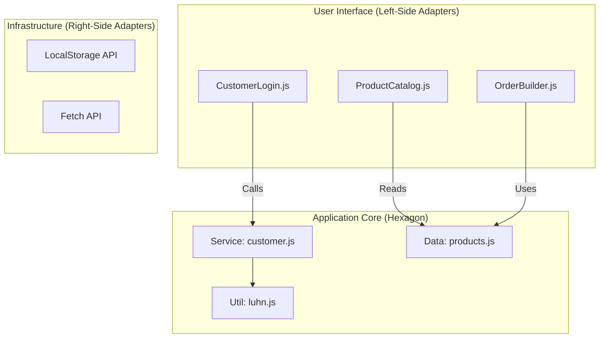

# EarlyBird Hexagonal Architecture

**Version:** 2.0 (React/Frontend Adaptation)
**Date:** 2025-11-19

## 1. Overview

This document describes the Hexagonal Architecture (Ports & Adapters) as applied to the EarlyBird frontend application. The goal is to decouple the **Application Core** (Business Logic) from the **UI Framework** (React) and **External Services** (Browser APIs).

---

## 2. Architecture Map

---

## 3. The Layers

### 3.1 Adapters (Technology Layer)
These are the **Inputs** and **Outputs** of the system.
- **Primary Adapters (Driving):** React Components (`src/components/`). They take user input (clicks, typing) and "drive" the application core.
- **Secondary Adapters (Driven):** In this MVP, these are minimal, but conceptually include the browser's `console`, `alert`, or `localStorage`.

### 3.2 Ports (The API)
In JavaScript modules, the **Port** is implicitly defined by the **exported functions** of the service modules.
- **Input Port:** `export function loginCustomer(number)` acts as a port. Any UI component can use it as long as it provides the correct arguments.

### 3.3 Application Core (Domain Layer)
This is the code that would remain valid even if we switched from React to Angular, or from the Browser to a Node.js CLI.
- `src/services/customer.js`
- `src/data/products.js`
- `src/utils/luhn.js`

---

## 4. Dependency Rule

**Source Code Dependencies must point only inward, toward the Application Core.**

- ✅ `CustomerLogin.js` (UI) imports `customer.js` (Core).
- ❌ `customer.js` (Core) imports `CustomerLogin.js` (UI).
- ❌ `luhn.js` (Core) imports `React`.

We strictly adhere to this rule to ensure testability and stability of the core business logic.