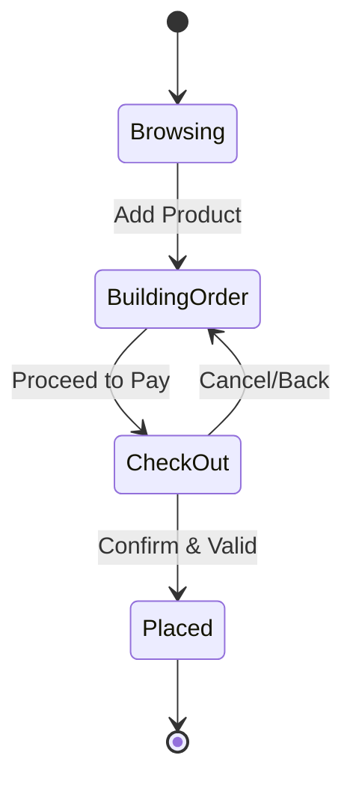
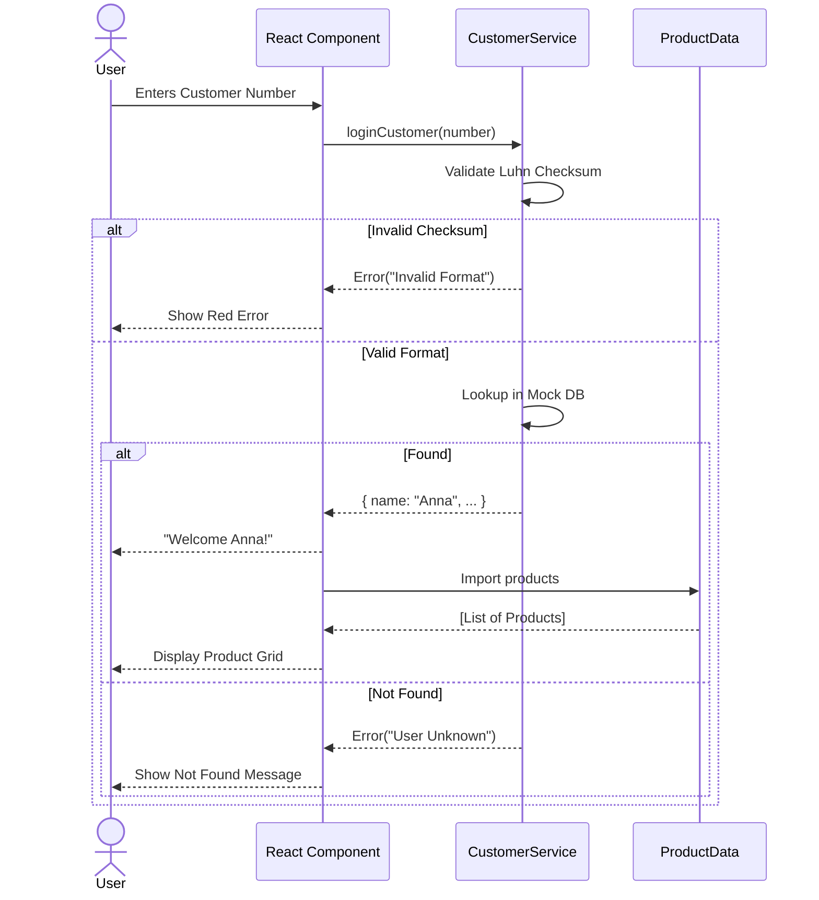
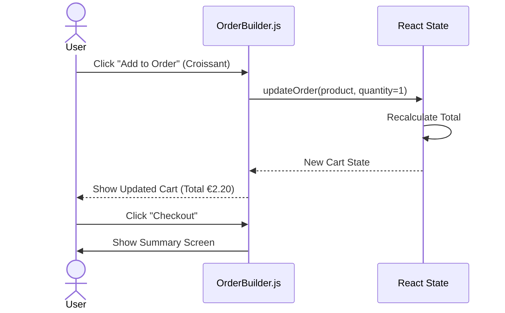

# EarlyBird Order Workflow

**Version:** 2.0
**Date:** 2025-11-19

## 1. Order Lifecycle State Machine

The order process follows a strict state machine to ensure data integrity.

---

## 2. Sequence Diagrams

### 2.1 Customer Login & Product Search

### 2.2 Order Placement

---

## 3. Workflow Rules

1.  **Authentication First:** A user *can* browse products without login (depending on requirements), but in the current "Elite" implementation, the flow suggests `CustomerLogin` is the entry gate or a prerequisite for `Checkout`.
2.  **Inventory Check:** (Future) Before confirming `Placed`, the system should check stock. currently assumed infinite.
3.  **Immutability:** Once an order transitions to `Placed`, it cannot be modified by the user.