# EarlyBird Application Core Architecture

**Version:** 1.0
**Date:** 2025-11-13
**Author:** Requirements Engineer + Software Architect + Model Designer (AI Agent)
**Based on:** THE SOFTWARE ENGINEERING BIBLE.md principles

---

## Table of Contents

1. [Requirements Classification](#requirements-classification)
2. [Architectural Principles Applied](#architectural-principles-applied)
3. [Application Core Design](#application-core-design)
4. [Component Catalog](#component-catalog)
5. [Order Submission Workflow](#order-submission-workflow)
6. [Change Impact Analysis](#change-impact-analysis)
7. [Architecture Diagrams](#architecture-diagrams)
8. [Design Rationale](#design-rationale)

---

## 1. Requirements Classification {#requirements-classification}

### 1.1 Blood Type Classification (A vs T vs O)

According to **Software Blood Types Principle** (Bible Section: Architecture Blood Types), we separate:

#### TYPE A (Application/Business Logic) - **STABLE**

These requirements represent core business domain knowledge that rarely changes:

| Req # | Requirement                                                     | Rationale                                                 |
|-------|-----------------------------------------------------------------|-----------------------------------------------------------|
| 1-6   | Product concept (simple, prepackaged, composite, pricing)       | Core domain: What is a product? Fundamental business rule |
| 8-10  | Customer concept (customer number format, no collective orders) | Core domain: Who is a customer?                           |
| 11    | Authentication + blacklist check                                | Core business rule: Access control                        |
| 13-16 | Follow-up orders (blueprint pattern)                            | Core domain: Order reuse logic                            |
| 17    | One address per customer                                        | Core business constraint                                  |
| 22    | Invoice calculation (products, amounts, prices, sum)            | Core domain: How to calculate invoice                     |
| 28-31 | Order cancellation rules (only before packing, not undoable)    | Core business process rules                               |
| 5     | Order composition (various products, various amounts)           | Core domain: What is an order?                            |
| 12    | Product search by characteristics                               | Core domain: How to find products                         |

**Key Insight:** These requirements define **WHAT the business does** - they are independent of technology.

#### TYPE T (Technology/Infrastructure) - **UNSTABLE**

These requirements are implementation details that change frequently:

| Req # | Requirement                | Technology       | Volatility                       |
|-------|----------------------------|------------------|----------------------------------|
| 7     | Phone ordering             | Phone system     | **CHANGED**: Web + SMS in future |
| 19-21 | Text processing for labels | Word processor   | **CHANGED**: Web application     |
| 24    | Spreadsheet for itinerary  | Excel/Sheets     | **CHANGED**: Web application     |
| 32-36 | Web-based application      | HTML/Browser     | Current technology choice        |
| 37-41 | SMS ordering               | SMS gateway      | Additional channel               |
| 42-43 | Payment system integration | External API     | Integration point                |
| 35    | Smartphone confirmation    | Mobile browser   | Delivery confirmation tech       |
| 44    | Nightly business report    | Batch processing | Reporting technology             |

**Key Insight:** These requirements define **HOW the system is accessed** - they are technology-dependent and change
over time.

#### TYPE O (Universal/Eternal)

No Type-O software identified (no universal mathematical/algorithmic requirements like sorting, encryption, etc.).

---

### 1.2 Stability Classification (Kano Model)

According to **Kano Model** (Bible Section: RE Kano Model), we classify requirements by change frequency:

#### STABLE (Core Business Rules)

- Product composition (simple + prepackaged)
- Order = Shopping cart with products
- Pricing logic (unit, price per unit)
- Invoice calculation (sum of line items)
- Cancellation constraints (only before packing)
- Blueprint pattern for follow-up orders

#### UNSTABLE (Technology Channels)

- Ordering interface: Phone → Web → SMS (already changing!)
- Label printing: Text processor → Web
- Itinerary calculation: Spreadsheet → Web
- Delivery confirmation: Paper → Smartphone

**Architectural Implication:** Separate stable core (domain logic) from unstable periphery (technology adapters).

---

## 2. Architectural Principles Applied {#architectural-principles-applied}

### 2.1 Primary Principle: **Blood Types Separation (A ≠ T)**

**Principle:** Application logic (TYPE A) MUST NOT depend on technology details (TYPE T).

**Application to EarlyBird:**

- **Application Core** contains ONLY domain logic (Order, Product, Customer, Invoice)
- **Technology Ring** surrounds core with adapters (Web UI, SMS Gateway, Payment API)
- Core knows **NOTHING** about HTTP, SMS, databases, browsers

**Evidence:** EarlyBird Case Study (Bible Section 30) shows this separation enabled:

- Phone → Web migration with 80% code stability
- Future SMS addition without core changes
- Technology evolution isolated from business logic

---

### 2.2 Secondary Principles

#### 2.2.1 Single Responsibility Principle (SRP)

Each component has ONE reason to change:

- **Order** changes when order business rules change
- **WebOrderController** changes when HTTP protocol changes
- **SmsOrderAdapter** changes when SMS format changes

#### 2.2.2 Acyclic Dependencies Principle (ADP)

No circular dependencies allowed:

- Dependencies flow **INWARD**: Technology → Application Core
- Core never depends on periphery

#### 2.2.3 Interface Segregation Principle (ISP)

Interfaces tailored to client needs:

- **IOrderService** (for customers): placeOrder, cancelOrder, getStatus
- **IPackingService** (for clerks): getNextOrder, markPacked
- **IDeliveryService** (for clerks): planItinerary, markDelivered

#### 2.2.4 Dependency Inversion Principle (DIP)

Application core defines interfaces, technology implements:

- Core defines `IPaymentGateway` interface
- Technology Ring provides `StripePaymentGateway` implementation
- Core depends on abstraction, not concretion

---

## 3. Application Core Design {#application-core-design}

### 3.1 Hexagonal Architecture (Ports & Adapters)

```
┌─────────────────────────────────────────────────────────┐
│                   TECHNOLOGY RING (TYPE T)               │
│  ┌───────────┐  ┌───────────┐  ┌───────────┐           │
│  │ Web UI    │  │ SMS       │  │ Payment   │           │
│  │ Adapter   │  │ Adapter   │  │ Adapter   │           │
│  └─────┬─────┘  └─────┬─────┘  └─────┬─────┘           │
│        │              │              │                   │
│   ┌────▼──────────────▼──────────────▼────┐             │
│   │         PORTS (Interfaces)             │             │
│   │  IOrderService  IPaymentGateway  etc.  │             │
│   └────────────────┬───────────────────────┘             │
│                    │                                     │
│   ┌────────────────▼───────────────────────┐             │
│   │      APPLICATION CORE (TYPE A)         │             │
│   │  ┌──────────┐  ┌──────────┐           │             │
│   │  │ Order    │  │ Product  │           │             │
│   │  │ Service  │  │ Catalog  │           │             │
│   │  └──────────┘  └──────────┘           │             │
│   │  ┌──────────┐  ┌──────────┐           │             │
│   │  │ Customer │  │ Invoice  │           │             │
│   │  │ Registry │  │ Generator│           │             │
│   │  └──────────┘  └──────────┘           │             │
│   │  ┌──────────────────────────┐         │             │
│   │  │   DOMAIN ENTITIES         │         │             │
│   │  │  Order, Product, Customer │         │             │
│   │  │  Invoice, DeliveryRoute   │         │             │
│   │  └──────────────────────────┘         │             │
│   └────────────────────────────────────────┘             │
└──────────────────────────────────────────────────────────┘
```

### 3.2 Core Components (TYPE A - Application Logic)

#### 3.2.1 Domain Entities (Aggregates)

**Product** (Aggregate Root)

```
Product (abstract)
├── SimpleProduct
│   - productCode: String
│   - name: String
│   - unit: String (e.g., "100g", "piece")
│   - pricePerUnit: Money
│   - calories: Int
│   - characteristics: Set<Characteristic>
│
└── PrepackagedProduct
    - productCode: String
    - name: String
    - components: List<ProductComponent>
    - calculateTotalPrice(): Money
    - calculateTotalCalories(): Int

ProductComponent
- product: Product (can be Simple OR Prepackaged - Composite Pattern!)
- amount: Int
```

**Customer** (Aggregate Root)

```
Customer
- customerNumber: CustomerNumber (Value Object: XX-XXXXXXX-C format)
- firstName: String
- surname: String
- address: Address
- password: Password (hashed)
- isBlacklisted: Boolean
- blacklistReason: String?
```

**Order** (Aggregate Root)

```
Order
- orderNumber: OrderNumber (Value Object: XXXXXXXX-C format)
- customer: Customer
- status: OrderStatus (Placed, Packed, Delivered, Canceled)
- orderLines: List<OrderLine>
- blueprintOrder: Order? (reference to previous order)
- placedAt: DateTime
- packedBy: PackingClerk?
- deliveredBy: DeliveryClerk?
- canCancel(): Boolean
- calculateTotal(): Money

OrderLine
- product: Product
- amount: Int
- priceSnapshot: Money (price at time of order)

OrderStatus (Enum)
- PLACED
- PACKED
- OUT_FOR_DELIVERY
- DELIVERED
- CANCELED
```

**Invoice** (Aggregate Root)

```
Invoice
- invoiceNumber: InvoiceNumber
- order: Order
- customer: Customer
- orderLines: List<InvoiceOrderLine>
- totalAmount: Money
- printedCopies: Int
- generateNextCopy(): InvoiceCopy

InvoiceOrderLine
- product: Product
- amount: Int
- pricePerUnit: Money
- lineTotal: Money
```

**DeliveryRoute** (Aggregate Root)

```
DeliveryRoute
- routeId: RouteId
- deliveryClerk: DeliveryClerk
- orders: List<Order>
- optimizedStops: List<DeliveryStop>
- totalDistance: Distance
- estimatedDuration: Duration

DeliveryStop
- order: Order
- customer: Customer
- address: Address
- sequenceNumber: Int
```

---

#### 3.2.2 Application Services (Use Cases)

**OrderService**

```
Responsibilities:
- Orchestrates order placement workflow
- Validates business rules
- Coordinates between aggregates

Methods:
+ placeOrder(customer, orderLines, blueprintOrder?): Order
+ cancelOrder(orderNumber): void
+ getOrderStatus(orderNumber): OrderStatus
+ searchProducts(characteristics): List<Product>
+ createFollowUpOrder(customer, previousOrderNumber): Order

Business Rules Enforced:
- Customer not blacklisted
- Blueprint order belongs to customer
- Cancellation only if not packed
- Order total >= 0
```

**ProductCatalog**

```
Responsibilities:
- Product search and retrieval
- Product hierarchy navigation

Methods:
+ findProduct(productCode): Product
+ searchByCharacteristics(maxCalories?, maxPrice?): List<Product>
+ getAllProducts(): List<Product>
+ getProductComponents(prepackagedProduct): List<ProductComponent>
```

**CustomerRegistry**

```
Responsibilities:
- Customer authentication
- Customer data retrieval
- Blacklist management

Methods:
+ authenticate(customerNumber, password): Customer
+ isBlacklisted(customerNumber): Boolean
+ getCustomer(customerNumber): Customer
```

**InvoiceGenerator**

```
Responsibilities:
- Generate invoices from orders
- Track invoice copies
- Calculate totals

Methods:
+ generateInvoice(order): Invoice
+ printCopy(invoice): InvoiceCopy
+ getInvoice(invoiceNumber): Invoice
```

**DeliveryPlanner**

```
Responsibilities:
- Plan optimal delivery routes
- Assign orders to delivery clerks
- Calculate itineraries

Methods:
+ planRoute(orders, deliveryClerk): DeliveryRoute
+ optimizeRoute(deliveryRoute): DeliveryRoute
+ markDelivered(order): void
```

**PackingService**

```
Responsibilities:
- Manage packing workflow
- Assign orders to packing clerks
- Trigger payment notification

Methods:
+ getNextOrderToPack(): Order
+ markPacked(order, packingClerk): void
+ assignDeliveryClerk(order, deliveryClerk): void
+ triggerPaymentNotification(order): void
```

---

### 3.3 Ports (Interfaces to Outside World)

#### Inbound Ports (How Application is Used)

```
IOrderService
+ placeOrder(customer, orderLines, blueprintOrder?): Order
+ cancelOrder(orderNumber): void
+ getOrderStatus(orderNumber): OrderStatus

IProductCatalog
+ searchProducts(characteristics): List<Product>
+ getProduct(productCode): Product

ICustomerRegistry
+ authenticate(customerNumber, password): Customer
```

#### Outbound Ports (How Application Uses External Systems)

```
IPaymentGateway
+ notifyExpectedPayment(customerNumber, orderNumber, amount, date): void

IReportGenerator
+ generateBusinessReport(orders, date): Report

INotificationService
+ sendSms(phoneNumber, message): void
+ sendConfirmation(orderNumber, customer): void
```

---

### 3.4 Technology Ring (TYPE T - Adapters)

**WebOrderController** (Inbound Adapter)

```
Responsibilities:
- Handle HTTP requests
- Convert JSON to domain objects
- Call OrderService

Technologies: ASP.NET Core, HTTP, JSON
Changes when: Web framework changes
```

**SmsOrderAdapter** (Inbound Adapter)

```
Responsibilities:
- Parse SMS messages
- Convert to domain commands
- Call OrderService
- Send SMS responses

Technologies: SMS Gateway API
Changes when: SMS format or gateway changes
```

**PaymentGatewayAdapter** (Outbound Adapter)

```
Responsibilities:
- Implement IPaymentGateway
- Translate to payment system's format
- Send expected payment records

Technologies: External Payment API
Changes when: Payment system changes
```

**DatabaseRepository** (Outbound Adapter)

```
Responsibilities:
- Persist domain entities
- Retrieve domain entities
- Implement IOrderRepository, ICustomerRepository, etc.

Technologies: SQL Database, ORM
Changes when: Database technology changes
```

---

## 4. Component Catalog {#component-catalog}

### 4.1 Application Core Components (TYPE A)

| Component            | Responsibility                         | Depends On               | Used By                   |
|----------------------|----------------------------------------|--------------------------|---------------------------|
| **Order**            | Order aggregate root, business rules   | Product, Customer        | OrderService              |
| **Product**          | Product hierarchy (simple/prepackaged) | -                        | Order, ProductCatalog     |
| **Customer**         | Customer aggregate root                | -                        | Order, CustomerRegistry   |
| **Invoice**          | Invoice generation logic               | Order                    | InvoiceGenerator          |
| **DeliveryRoute**    | Route planning domain logic            | Order                    | DeliveryPlanner           |
| **OrderService**     | Place/cancel order use cases           | Order, Product, Customer | Web/SMS Adapters          |
| **ProductCatalog**   | Product search use cases               | Product                  | OrderService, Web Adapter |
| **CustomerRegistry** | Authentication use cases               | Customer                 | OrderService, Web Adapter |
| **InvoiceGenerator** | Invoice creation use cases             | Invoice, Order           | PackingService            |
| **DeliveryPlanner**  | Route optimization use cases           | DeliveryRoute, Order     | DeliveryService           |
| **PackingService**   | Packing workflow use cases             | Order, IPaymentGateway   | Packing Adapter           |

---

### 4.2 Technology Adapter Components (TYPE T)

| Component                  | Type     | Responsibility           | Technologies  | Depends On (Core)      |
|----------------------------|----------|--------------------------|---------------|------------------------|
| **WebOrderController**     | Inbound  | Handle web requests      | HTTP, JSON    | OrderService           |
| **WebProductController**   | Inbound  | Product search UI        | HTTP, JSON    | ProductCatalog         |
| **SmsOrderAdapter**        | Inbound  | Parse SMS orders         | SMS Gateway   | OrderService           |
| **PackingClerkUI**         | Inbound  | Packing clerk interface  | HTML, Browser | PackingService         |
| **DeliveryClerkUI**        | Inbound  | Delivery clerk interface | HTML, Mobile  | DeliveryPlanner        |
| **PaymentGatewayAdapter**  | Outbound | Payment integration      | REST API      | IPaymentGateway        |
| **DatabaseRepository**     | Outbound | Data persistence         | SQL, ORM      | IRepository interfaces |
| **ReportGenerator**        | Outbound | Business reports         | PDF, Email    | IReportGenerator       |
| **SmsNotificationAdapter** | Outbound | Send SMS                 | SMS Gateway   | INotificationService   |

---

## 5. Order Submission Workflow {#order-submission-workflow}

### 5.1 Sequence: Customer Places Order via Web

**Actors:**

- Customer (user)
- WebOrderController (TYPE T - Technology)
- OrderService (TYPE A - Application)
- CustomerRegistry (TYPE A)
- ProductCatalog (TYPE A)
- Order (TYPE A - Domain Entity)
- DatabaseRepository (TYPE T)

**Flow:**

1. **Customer submits order form** (HTTP POST)
    - Data: customerNumber, password, List<{productCode, amount}>
    - Optional: blueprintOrderNumber

2. **WebOrderController receives request**
    - Parse JSON
    - Extract customerNumber, password, orderLines

3. **WebOrderController → CustomerRegistry.authenticate(customerNumber, password)**
    - CustomerRegistry validates credentials
    - CustomerRegistry checks if blacklisted
    - Returns: Customer object OR throws AuthenticationException

4. **WebOrderController → ProductCatalog.getProduct(productCode)** (for each order line)
    - ProductCatalog retrieves Product entities
    - Returns: Product objects

5. **WebOrderController → OrderService.placeOrder(customer, orderLines, blueprintOrder?)**

6. **OrderService orchestrates order placement:**

   a. **IF blueprintOrderNumber provided:**
    - Retrieve blueprint Order from repository
    - Validate: blueprint.customer == customer
    - Add blueprint's order lines to shopping cart

   b. **Validate order lines:**
    - Check products exist
    - Check amounts > 0

   c. **Create Order aggregate:**
      ```
      order = new Order(
        orderNumber: generateOrderNumber(),
        customer: customer,
        orderLines: orderLines,
        blueprintOrder: blueprintOrder,
        status: OrderStatus.PLACED,
        placedAt: DateTime.now()
      )
      ```

   d. **Calculate total:**
    - order.calculateTotal()

   e. **Persist order:**
    - DatabaseRepository.save(order)

   f. **Return order**

7. **WebOrderController sends response**
    - HTTP 200 OK
    - JSON: { orderNumber, totalAmount, estimatedDeliveryTime }

---

### 5.2 Data Exchange Between Components

**Customer → WebOrderController:**

```json
{
  "customerNumber": "23-3911004-5",
  "password": "mypswd",
  "orderLines": [
    {
      "productCode": "EGG",
      "amount": 1
    },
    {
      "productCode": "TOAST",
      "amount": 2
    },
    {
      "productCode": "OJUICE",
      "amount": 1
    }
  ],
  "blueprintOrderNumber": "26127384-2"
}
```

**WebOrderController → CustomerRegistry:**

```
authenticate(
  customerNumber: CustomerNumber("23-3911004-5"),
  password: "mypswd"
)
Returns: Customer object
```

**WebOrderController → ProductCatalog:**

```
getProduct(productCode: "EGG")
getProduct(productCode: "TOAST")
getProduct(productCode: "OJUICE")

Returns: Product objects with pricePerUnit, unit, etc.
```

**WebOrderController → OrderService:**

```
placeOrder(
  customer: Customer,
  orderLines: [
    OrderLine(product: Product("EGG"), amount: 1),
    OrderLine(product: Product("TOAST"), amount: 2),
    OrderLine(product: Product("OJUICE"), amount: 1)
  ],
  blueprintOrder: Order("26127384-2") // optional
)

Returns: Order with orderNumber
```

**OrderService → DatabaseRepository:**

```
save(order: Order)

Persists:
- Order aggregate
- OrderLine entities (with price snapshot!)
- Reference to blueprint order (if any)
```

**WebOrderController → Customer:**

```json
{
  "orderNumber": "26127385-3",
  "totalAmount": 8.50,
  "estimatedDeliveryTime": "2025-11-13T08:15:00Z",
  "status": "PLACED"
}
```

---

### 5.3 Order Packing Workflow

**Flow:**

1. **PackingClerk opens packing UI**
    - PackingClerkUI → PackingService.getNextOrderToPack()

2. **PackingService returns next PLACED order**

3. **PackingClerk assembles products physically**

4. **PackingClerk clicks "Mark Packed" + assigns DeliveryClerk**
    - PackingClerkUI → PackingService.markPacked(order, packingClerk, deliveryClerk)

5. **PackingService orchestrates:**

   a. **Update order status:**
    - order.status = OrderStatus.PACKED
    - order.packedBy = packingClerk
    - order.assignedTo = deliveryClerk

   b. **Generate invoice:**
    - InvoiceGenerator.generateInvoice(order)
    - Print two copies

   c. **Notify payment system:**
    - PaymentGatewayAdapter.notifyExpectedPayment(
      customerNumber, orderNumber, totalAmount, expectedDate
      )

   d. **Persist changes:**
    - DatabaseRepository.save(order)
    - DatabaseRepository.save(invoice)

6. **PackingClerkUI displays:**
    - Invoice PDF (for printing label + invoice)
    - Confirmation: "Order packed successfully"

---

### 5.4 Delivery Workflow

**Flow:**

1. **DeliveryClerk opens delivery UI**
    - DeliveryClerkUI → DeliveryPlanner.getMyAssignedOrders(deliveryClerk)

2. **DeliveryClerk clicks "Plan Route"**
    - DeliveryClerkUI → DeliveryPlanner.planRoute(orders, deliveryClerk)

3. **DeliveryPlanner orchestrates:**

   a. **Create DeliveryRoute:**
      ```
      route = new DeliveryRoute(
        orders: orders,
        deliveryClerk: deliveryClerk
      )
      ```

   b. **Optimize route (traveling salesman problem):**
    - Sort orders by geographic proximity
    - Minimize total distance
    - Return optimized DeliveryStop sequence

   c. **Return route**

4. **DeliveryClerkUI displays:**
    - Map with optimal route
    - List of stops with addresses
    - Printable itinerary

5. **DeliveryClerk delivers orders:**
    - At each customer:
        - Present smartphone with confirmation UI
        - Customer enters password
        - DeliveryClerkUI → CustomerRegistry.authenticate(customerNumber, password)
        - If authenticated:
            - DeliveryClerkUI → DeliveryPlanner.markDelivered(order)
            - order.status = OrderStatus.DELIVERED

---

## 6. Change Impact Analysis {#change-impact-analysis}

### 6.1 New Requirement (a): Standing Orders

**Requirement:** "Standing orders (e.g. getting coffee and toast every Sunday) should be possible."

#### 6.1.1 Components Requiring Changes

**CORE Components (TYPE A) - Need Extension:**

**StandingOrder** (New Domain Entity - Aggregate Root)

```
StandingOrder
- standingOrderId: StandingOrderId
- customer: Customer
- orderTemplate: Order (acts as blueprint)
- recurrence: RecurrencePattern (daily/weekly/monthly)
- startDate: Date
- endDate: Date?
- isActive: Boolean
- nextExecutionDate: Date

RecurrencePattern
- type: RecurrenceType (DAILY, WEEKLY, MONTHLY)
- interval: Int (e.g., every 2 weeks)
- dayOfWeek: DayOfWeek? (for weekly: SUNDAY)
- dayOfMonth: Int? (for monthly: 15th)
```

**StandingOrderService** (New Application Service)

```
+ createStandingOrder(customer, orderTemplate, recurrence): StandingOrder
+ cancelStandingOrder(standingOrderId): void
+ getMyStandingOrders(customer): List<StandingOrder>
+ executeStandingOrder(standingOrderId): Order
```

**OrderService** (Modified)

```
+ placeOrder(...) // UNCHANGED
+ placeStandingOrder(standingOrder): Order // NEW METHOD
  - Creates Order from standingOrder.orderTemplate
  - Sets blueprintOrder = standingOrder.orderTemplate
  - Returns new Order
```

**StandingOrderScheduler** (New Application Service)

```
+ checkDueStandingOrders(): List<StandingOrder>
+ executeScheduledOrders(): void
  - Runs periodically (e.g., every hour)
  - Checks standingOrders where nextExecutionDate <= NOW
  - Calls OrderService.placeStandingOrder(standingOrder)
  - Updates standingOrder.nextExecutionDate
```

**TECHNOLOGY Components (TYPE T) - Need Adaptation:**

**WebStandingOrderController** (New Adapter)

```
+ POST /standing-orders (create)
+ GET /standing-orders (list)
+ DELETE /standing-orders/{id} (cancel)
```

**ScheduledJobAdapter** (New Adapter)

```
Technologies: Quartz.NET, Hangfire, or cron job
Responsibility: Trigger StandingOrderScheduler.executeScheduledOrders() periodically
```

**DatabaseRepository** (Modified)

```
+ saveStandingOrder(standingOrder): void
+ getStandingOrders(customer): List<StandingOrder>
+ getDueStandingOrders(now): List<StandingOrder>
```

#### 6.1.2 Impact Summary

| Component Category       | Impact Level    | Reason                                                     |
|--------------------------|-----------------|------------------------------------------------------------|
| **Domain Entities**      | **Extension**   | New StandingOrder aggregate, existing entities UNCHANGED   |
| **Application Services** | **Extension**   | New StandingOrderService, OrderService gets ONE new method |
| **Technology Adapters**  | **New Adapter** | WebStandingOrderController + ScheduledJobAdapter           |
| **Existing Features**    | **ZERO IMPACT** | Regular orders, packing, delivery - all unchanged          |

**Key Insight:** Thanks to **Open/Closed Principle** and **Application Core Pattern**, standing orders are added via *
*extension**, not **modification**. Existing code is stable!

---

### 6.2 New Requirement (b): All-Day Meals (Not Just Breakfast)

**Requirement:** "EarlyBird should deliver all kinds of meals all day, not just breakfast."

#### 6.2.1 Components Requiring Changes

**CORE Components (TYPE A) - Minimal Impact:**

**Product** (Extended)

```
Product (abstract)
+ mealType: MealType? // NEW PROPERTY (BREAKFAST, LUNCH, DINNER, SNACK, ALL_DAY)
+ isAvailableAt(timeOfDay): Boolean // NEW METHOD

Example:
- Croissant: mealType = BREAKFAST
- Pizza: mealType = LUNCH
- Midnight Snack Box: mealType = SNACK
- Coffee: mealType = ALL_DAY
```

**ProductCatalog** (Extended)

```
+ searchByCharacteristics(..., mealType?) // EXTENDED (new parameter)
+ getAvailableProducts(timeOfDay): List<Product> // NEW METHOD
```

**Order** (UNCHANGED)

- Still contains List<OrderLine>
- Product type is irrelevant to Order logic
- **ZERO IMPACT**

**OrderService** (UNCHANGED)

- placeOrder() still works regardless of product.mealType
- **ZERO IMPACT**

**TECHNOLOGY Components (TYPE T) - UI Adaptation:**

**WebProductController** (Modified)

```
+ GET /products?mealType=LUNCH // NEW FILTER
+ GET /products/available-now // NEW ENDPOINT
  - Returns products available at current time
```

**WebOrderController** (UNCHANGED)

- Still accepts orderLines regardless of product type
- **ZERO IMPACT**

**DatabaseRepository** (Extended)

```
+ getProductsByMealType(mealType): List<Product> // NEW QUERY
```

#### 6.2.2 Impact Summary

| Component Category   | Impact Level  | Reason                                                      |
|----------------------|---------------|-------------------------------------------------------------|
| **Product Entity**   | **Extension** | Add mealType property (nullable for backward compatibility) |
| **Order Entity**     | **ZERO**      | Order doesn't care what products it contains                |
| **OrderService**     | **ZERO**      | Business logic unchanged                                    |
| **ProductCatalog**   | **Extension** | Add mealType filter method                                  |
| **Web UI**           | **Cosmetic**  | Add meal type filter to product search                      |
| **Packing/Delivery** | **ZERO**      | Packing and delivery process unchanged                      |

**Key Insight:** The Product abstraction is **open for extension** (new product types). The Order abstraction is *
*closed for modification** (order logic independent of product types). This is **Open/Closed Principle** in action!

**Backward Compatibility:** Existing products without mealType → default to ALL_DAY or BREAKFAST.

---

### 6.3 New Requirement (c): Online Delivery Tracking

**Requirement:** "Deliveries should be trackable online by the customer."

#### 6.3.1 Components Requiring Changes

**CORE Components (TYPE A) - Extension:**

**DeliveryRoute** (Extended)

```
DeliveryRoute
+ currentStopIndex: Int // NEW: Track progress
+ estimatedArrival(stop): DateTime // NEW: ETA calculation
+ getCurrentLocation(): GeoCoordinate? // NEW (if GPS tracking enabled)

getCurrentStop(): DeliveryStop
  return optimizedStops[currentStopIndex]

getNextStop(): DeliveryStop?
  if currentStopIndex + 1 < optimizedStops.count:
    return optimizedStops[currentStopIndex + 1]
  return null
```

**Order** (Extended)

```
Order
+ currentLocation: GeoCoordinate? // NEW (delivery clerk's current position)
+ estimatedDeliveryTime: DateTime? // NEW (calculated from route)
+ deliveryProgress: DeliveryProgress // NEW (enum: NOT_STARTED, IN_TRANSIT, NEARBY, DELIVERED)

DeliveryProgress (Enum)
- NOT_STARTED
- IN_TRANSIT
- NEARBY (within 5 minutes)
- DELIVERED
```

**DeliveryTrackingService** (New Application Service)

```
+ getDeliveryStatus(orderNumber): DeliveryStatus
  - Returns: { status, currentLocation, estimatedArrival, deliveryClerkName }
+ updateDeliveryLocation(deliveryClerk, location): void
  - Called by delivery clerk's mobile app periodically
+ getMyDeliveryStatus(customer): List<DeliveryStatus>
  - Returns status for all customer's active orders
```

**TECHNOLOGY Components (TYPE T) - New Adapters:**

**WebTrackingController** (New Adapter)

```
+ GET /orders/{orderNumber}/tracking
  - Public endpoint (requires orderNumber only)
  - Returns: DeliveryStatus JSON
+ GET /my-orders/tracking
  - Authenticated endpoint
  - Returns all customer's order statuses
```

**DeliveryClerkMobileApp** (New Adapter)

```
Technologies: Mobile app with GPS
Responsibilities:
- Capture GPS coordinates periodically
- POST /delivery/location { deliveryClerkId, latitude, longitude }
- Update DeliveryRoute.currentLocation
```

**WebSocketAdapter** (New Adapter - Optional)

```
Technologies: WebSocket or SignalR
Responsibilities:
- Push real-time updates to customer's browser
- When delivery location updates → push to customer
```

**GeocodingAdapter** (New Adapter - Optional)

```
Technologies: Google Maps API, OpenStreetMap
Responsibilities:
- Calculate ETA based on current location + route
- Implement DeliveryRoute.estimatedArrival()
```

#### 6.3.2 Impact Summary

| Component Category          | Impact Level  | Reason                               |
|-----------------------------|---------------|--------------------------------------|
| **DeliveryRoute**           | **Extension** | Add tracking properties              |
| **Order**                   | **Extension** | Add delivery progress                |
| **DeliveryTrackingService** | **NEW**       | New use case                         |
| **OrderService**            | **ZERO**      | Order placement unchanged            |
| **ProductCatalog**          | **ZERO**      | No impact                            |
| **Packing**                 | **ZERO**      | Packing process unchanged            |
| **WebTrackingController**   | **NEW**       | New public API endpoint              |
| **Mobile App**              | **NEW**       | Delivery clerk needs GPS-enabled app |

**Key Insight:** Tracking is a **new feature** that extends existing entities (Order, DeliveryRoute) without modifying
their core responsibilities. The **Application Core** remains stable; only new adapters are added.

**Trade-off:** Real-time tracking adds complexity (GPS, mobile app, WebSocket). This is a **TYPE T** concern (technology
choice). The **TYPE A** logic (what tracking means) is simple: "Where is my order?"

---

## 7. Architecture Diagrams {#architecture-diagrams}

All diagrams use **Mermaid** format and render natively in GitHub/GitLab.

---

### 7.1 Hexagonal Architecture (Ports & Adapters)

# EarlyBird Hexagonal Architecture (Ports & Adapters)

```mermaid
graph TB
    subgraph TechRing["TECHNOLOGY RING (TYPE T - Unstable)"]
        subgraph InboundAdapters["INBOUND ADAPTERS<br/>(External → Core)"]
            WebOrder["WebOrderController<br/>(HTTP/JSON)"]:::typeT
            SmsOrder["SmsOrderAdapter<br/>(SMS Gateway)"]:::typeT
            WebProduct["WebProductController<br/>(HTTP/JSON)"]:::typeT
            PackingUI["PackingClerkUI<br/>(Web Browser)"]:::typeT
            DeliveryUI["DeliveryClerkUI<br/>(Mobile App)"]:::typeT
        end

        subgraph OutboundAdapters["OUTBOUND ADAPTERS<br/>(Core → External)"]
            Database["DatabaseRepository<br/>(SQL/ORM)"]:::typeT
            Payment["PaymentGatewayAdapter<br/>(REST API)"]:::typeT
            Reports["ReportGeneratorAdapter<br/>(PDF/Email)"]:::typeT
            SmsNotify["SmsNotificationAdapter<br/>(SMS Gateway)"]:::typeT
        end
    end

    subgraph Ports["PORTS (Interfaces)"]
        IOrder["IOrderService"]:::interface
        IProduct["IProductCatalog"]:::interface
        ICustomer["ICustomerRegistry"]:::interface
        IPacking["IPackingService"]:::interface
        IDelivery["IDeliveryPlanner"]:::interface
        IPayment["IPaymentGateway"]:::interface
        IReport["IReportGenerator"]:::interface
        INotify["INotificationService"]:::interface
        IOrderRepo["IOrderRepository"]:::interface
        IProductRepo["IProductRepository"]:::interface
        ICustomerRepo["ICustomerRepository"]:::interface
    end

    subgraph AppCore["APPLICATION CORE (TYPE A - Stable)"]
        subgraph Services["APPLICATION SERVICES<br/>(Use Cases)"]
            OrderSvc["OrderService"]:::typeA
            ProductCatalog["ProductCatalog"]:::typeA
            CustomerReg["CustomerRegistry"]:::typeA
            PackingSvc["PackingService"]:::typeA
            DeliverySvc["DeliveryPlanner"]:::typeA
            InvoiceSvc["InvoiceGenerator"]:::typeA
        end

        subgraph Entities["DOMAIN ENTITIES<br/>(Aggregates)"]
            Order["Order<br/>+ OrderLine<br/>+ OrderStatus"]:::typeA
            Product["Product<br/>├─ SimpleProduct<br/>└─ PrepackagedProduct"]:::typeA
            Customer["Customer<br/>+ CustomerNumber<br/>+ Address"]:::typeA
            Invoice["Invoice<br/>+ InvoiceOrderLine"]:::typeA
            DeliveryRoute["DeliveryRoute<br/>+ DeliveryStop"]:::typeA
        end

        subgraph ValueObjects["VALUE OBJECTS"]
            VOs["OrderNumber<br/>CustomerNumber<br/>Money<br/>Address"]:::typeO
        end
    end

%% INBOUND: Technology -> Ports -> Application Core
    WebOrder -.->|uses| IOrder
    SmsOrder -.->|uses| IOrder
    WebProduct -.->|uses| IProduct
    PackingUI -.->|uses| IPacking
    DeliveryUI -.->|uses| IDelivery
    IOrder -.->|implements| OrderSvc
    IProduct -.->|implements| ProductCatalog
    ICustomer -.->|implements| CustomerReg
    IPacking -.->|implements| PackingSvc
    IDelivery -.->|implements| DeliverySvc
%% OUTBOUND: Application Core -> Ports -> Technology
    OrderSvc -.->|uses| IPayment
    OrderSvc -.->|uses| IOrderRepo
    PackingSvc -.->|uses| IPayment
    PackingSvc -.->|uses| INotify
    DeliverySvc -.->|uses| IReport
    ProductCatalog -.->|uses| IProductRepo
    CustomerReg -.->|uses| ICustomerRepo
    IPayment -.->|implements| Payment
    IReport -.->|implements| Reports
    INotify -.->|implements| SmsNotify
    IOrderRepo -.->|implements| Database
    IProductRepo -.->|implements| Database
    ICustomerRepo -.->|implements| Database
%% Application Services -> Domain Entities
    OrderSvc --> Order
    OrderSvc --> Product
    OrderSvc --> Customer
    ProductCatalog --> Product
    CustomerReg --> Customer
    InvoiceSvc --> Invoice
    InvoiceSvc --> Order
    DeliverySvc --> DeliveryRoute
    DeliverySvc --> Order
    PackingSvc --> Order
    PackingSvc --> Invoice
%% Domain Entities -> Value Objects
    Order --> VOs
    Customer --> VOs
    Product --> VOs
    Invoice --> VOs
    classDef typeA fill: #E8D5F2, stroke: #333, stroke-width: 2px, color: #000
    classDef typeT fill: #D5E8F7, stroke: #333, stroke-width: 2px, color: #000
    classDef typeO fill: #FFE5CC, stroke: #333, stroke-width: 2px, color: #000
    classDef interface fill: #F0F0F0, stroke: #333, stroke-width: 1px, color: #000
```



## Architecture Principles

### 1. Dependency Direction

**All dependencies point INWARD →**

- Technology Ring depends on Ports (interfaces)
- Ports are implemented by Application Core
- Application Core is **independent** of technology

### 2. Blood Type Separation

| Color     | Type       | Stability | Change Drivers            |
|-----------|------------|-----------|---------------------------|
| 🟪 Purple | TYPE A     | Stable    | Business rules change     |
| 🟦 Blue   | TYPE T     | Unstable  | Technology evolution      |
| 🟧 Orange | TYPE O     | Universal | Rarely changes            |
| ⬜ Gray    | Interfaces | Contracts | Negotiated between layers |

### 3. Technology Independence

**TYPE T (Technology - UNSTABLE) Changes when:**

- HTTP → GraphQL
- SMS → WhatsApp
- SQL → NoSQL
- Payment provider changes

**TYPE A (Application - STABLE) Changes only when:**

- Business rules change
- Domain concepts evolve

**Result:** Application Core is **independent** of technology!

### 4. Adapter Replaceability

**Example: Changing SMS Gateway**

```
BEFORE: TwilioSmsAdapter implements INotificationService
AFTER:  WhatsAppAdapter implements INotificationService

Impact: ZERO changes to Application Core
        Only adapter replacement needed
```

### 5. Testability

**Application Core can be tested WITHOUT:**

- Real HTTP server
- Real database
- Real SMS gateway
- Real payment processor

**How:** Use mock implementations of interfaces for testing

---

## Component Catalog

### Inbound Adapters (External → Core)

| Component            | Technology   | Responsibility                           |
|----------------------|--------------|------------------------------------------|
| WebOrderController   | ASP.NET Core | Parse HTTP requests, translate to domain |
| SmsOrderAdapter      | Twilio/Nexmo | Parse SMS messages, translate to domain  |
| WebProductController | ASP.NET Core | Handle product search requests           |
| PackingClerkUI       | React/Vue    | Packing clerk interface                  |
| DeliveryClerkUI      | React Native | Delivery tracking mobile app             |

### Ports (Interfaces)

| Interface            | Purpose                        | Defined By       |
|----------------------|--------------------------------|------------------|
| IOrderService        | Place, cancel, query orders    | Application Core |
| IProductCatalog      | Search products                | Application Core |
| ICustomerRegistry    | Authenticate, manage customers | Application Core |
| IPaymentGateway      | Process payments               | Application Core |
| INotificationService | Send notifications             | Application Core |
| IOrderRepository     | Persist orders                 | Application Core |

### Application Services (Use Cases)

| Service          | Responsibility               | Type   |
|------------------|------------------------------|--------|
| OrderService     | Orchestrate order placement  | TYPE A |
| ProductCatalog   | Product search and retrieval | TYPE A |
| CustomerRegistry | Customer authentication      | TYPE A |
| PackingService   | Order packing workflow       | TYPE A |
| DeliveryPlanner  | Route optimization           | TYPE A |
| InvoiceGenerator | Invoice generation           | TYPE A |

### Domain Entities (Aggregates)

| Aggregate     | Contents                          | Business Rules                                |
|---------------|-----------------------------------|-----------------------------------------------|
| Order         | OrderLine, OrderStatus            | Total = Σ(line totals), Cancel only if PLACED |
| Product       | SimpleProduct, PrepackagedProduct | Composite pattern for prepackaged             |
| Customer      | CustomerNumber, Address           | Blacklist validation                          |
| Invoice       | InvoiceOrderLine                  | Generated from Order, multiple copies         |
| DeliveryRoute | DeliveryStop                      | Optimize for < 25 min delivery time           |

### Outbound Adapters (Core → External)

| Component              | Technology         | Responsibility               |
|------------------------|--------------------|------------------------------|
| DatabaseRepository     | PostgreSQL/EF Core | Persist entities to database |
| PaymentGatewayAdapter  | Stripe/PayPal      | Process credit card payments |
| ReportGeneratorAdapter | iTextSharp         | Generate PDF reports         |
| SmsNotificationAdapter | Twilio             | Send SMS notifications       |

---

## Benefits of Hexagonal Architecture

### 1. Technology Migration (Phone → Web → SMS)

**Without Hexagonal Architecture:**

- 100% codebase changes
- High risk
- Long migration time

**With Hexagonal Architecture:**

- 80% codebase stable (Application Core)
- 20% adapter changes
- Low risk (old and new can run simultaneously)

**Empirical Evidence:** EarlyBird case study showed 80% code stability during technology migration.

### 2. Parallel Development

**Teams can work independently:**

- Frontend team: Build WebOrderController adapter
- Backend team: Implement OrderService
- Integration team: Build DatabaseRepository adapter

**No conflicts:** All teams implement against agreed interfaces.

### 3. Testing Strategy

**Unit Tests:** Test Application Core without any adapters

- Mock IOrderRepository
- Mock IPaymentGateway
- Fast, isolated tests

**Integration Tests:** Test with real adapters

- Real database
- Real HTTP endpoints

**End-to-End Tests:** Test complete flow through adapters

### 4. Future-Proofing

**Easy to add new delivery channels:**

- Voice assistant (Alexa/Google Home)
- Mobile app
- Chatbot (Slack/Teams)

**How:** Just add new inbound adapter implementing IOrderService interface!

---

## Design Rationale

All architectural decisions trace back to **THE SOFTWARE ENGINEERING BIBLE.md**:

| Principle                     | Source                   | Applied Where                         |
|-------------------------------|--------------------------|---------------------------------------|
| Blood Type Separation (A/T/O) | Architecture Blood Types | Entire architecture                   |
| Hexagonal Architecture        | Architecture Patterns    | Ports & Adapters pattern              |
| Dependency Inversion (DIP)    | SOLID Principles         | All interfaces                        |
| Acyclic Dependencies (ADP)    | Coupling Principles      | No circular dependencies              |
| Interface Segregation (ISP)   | SOLID Principles         | Focused interfaces                    |
| Single Responsibility (SRP)   | Cohesion Principles      | Each component one reason to change   |
| Open/Closed Principle (OCP)   | Quality Principles       | Extensible via new adapters           |
| Kano Model                    | RE Kano Model            | Requirements stability classification |

**Empirical Evidence:**

- Mockus et al. (2000): Separation of Concerns reduces change propagation by **64%**
- EarlyBird Case Study: A/T separation enabled **80% code stability** during phone → web → SMS migration
- NASA Software Engineering Handbook: Information hiding required for Level-A critical software

---

### 7.2 Order Submission Workflow (Sequence Diagram)

# Order Submission Workflow - Component Cooperation & Data Exchange

```mermaid
sequenceDiagram
    autonumber
    participant Customer
    participant WebUI as WebOrderController<br/>(TYPE T)
    participant CustomerReg as CustomerRegistry<br/>(TYPE A)
    participant ProductCatalog as ProductCatalog<br/>(TYPE A)
    participant OrderService as OrderService<br/>(TYPE A)
    participant Order as Order<br/>(Domain Entity)
    participant Database as DatabaseRepository<br/>(TYPE T)

    rect rgb(240, 248, 255)
        Note over Customer, Database: Authentication Phase
        Customer ->>+ WebUI: POST /orders<br/>{customerNumber: "23-3911004-5",<br/>password: "mypswd",<br/>orderLines: [...]}
        WebUI ->>+ CustomerReg: authenticate(customerNumber, password)
        CustomerReg ->>+ Database: getCustomer(customerNumber)
        Database -->>- CustomerReg: Customer data
        CustomerReg ->> CustomerReg: validatePassword(password)
        CustomerReg ->> CustomerReg: checkBlacklist()

        alt Customer valid and not blacklisted
            CustomerReg -->> WebUI: Customer object
        else Authentication failed
            CustomerReg -->> WebUI: throw AuthenticationException
            WebUI -->>- Customer: 401 Unauthorized
            Note over Customer, WebUI: Flow ends here for failed authentication
        end
        deactivate CustomerReg
    end

    rect rgb(245, 255, 250)
        Note over Customer, Database: Product Retrieval Phase

        loop For each orderLine in request
            WebUI ->>+ ProductCatalog: getProduct(productCode)
            ProductCatalog ->>+ Database: findProduct(productCode)
            Database -->>- ProductCatalog: Product (with price, unit, etc.)
            ProductCatalog -->> WebUI: Product object
        end

        Note over WebUI: WebUI now has:<br/>- Customer object<br/>- List<Product> objects<br/>- Order line amounts
    end

    rect rgb(255, 250, 240)
        Note over Customer, Database: Order Placement Phase
        WebUI ->>+ OrderService: placeOrder(customer, orderLines, blueprintOrder?)

        opt BlueprintOrder provided
            OrderService ->>+ Database: getOrder(blueprintOrderNumber)
            Database -->>- OrderService: Blueprint Order
            OrderService ->> OrderService: validateBlueprintOwnership<br/>(blueprint.customer == customer)
            OrderService ->> OrderService: mergeOrderLines<br/>(blueprint lines + new lines)
        end

        OrderService ->> OrderService: validateOrderLines<br/>(products exist, amounts > 0)
        OrderService ->>+ Order: create Order(<br/>orderNumber: generateOrderNumber(),<br/>customer: customer,<br/>orderLines: orderLines,<br/>blueprintOrder: blueprintOrder?,<br/>status: PLACED)
        Order ->> Order: calculateTotal()
        Note right of Order: For each OrderLine:<br/>lineTotal = product.pricePerUnit × amount<br/>orderTotal = Σ(lineTotals)
        Order -->> OrderService: Order (with total)
        OrderService ->>+ Database: save(order)
        Database ->> Database: BEGIN TRANSACTION
        Database ->> Database: INSERT INTO Orders<br/>(orderNumber, customerId, status, total, placedAt)
        Database ->> Database: INSERT INTO OrderLines<br/>(orderId, productId, amount, priceSnapshot)
        Note right of Database: Price Snapshot: Store current price<br/>in OrderLine for historical accuracy<br/>(prices may change after order placed)
        Database ->> Database: COMMIT TRANSACTION
        Database -->>- OrderService: Success
        OrderService -->> WebUI: Order object<br/>(with orderNumber, total, status)
        deactivate Order
    end

    rect rgb(250, 250, 255)
        Note over Customer, Database: Response Phase
        WebUI -->> Customer: HTTP 200 OK<br/>{orderNumber: "26127385-3",<br/>totalAmount: 8.50,<br/>status: "PLACED",<br/>estimatedDelivery: "08:15"}
        deactivate WebUI
    end

    rect rgb(255, 255, 240)
        Note over Customer, Database: Data Exchanged:<br/><br/>Customer → WebUI: HTTP POST with JSON<br/> - customerNumber (String)<br/> - password (String)<br/> - orderLines: [{productCode, amount}]<br/> - blueprintOrderNumber (Optional)<br/><br/>WebUI → CustomerRegistry: Domain objects<br/> - customerNumber (CustomerNumber value object)<br/> - password (String)<br/><br/>WebUI → ProductCatalog: Query<br/> - productCode (String)<br/><br/>WebUI → OrderService: Domain objects<br/> - customer (Customer aggregate)<br/> - orderLines (List<OrderLine> with Product references)<br/><br/>OrderService → Database: Domain entities<br/> - order (Order aggregate with all details)<br/><br/>All TYPE T components (WebUI, Database) translate<br/>between their format and TYPE A domain objects!
    end

    rect rgb(255, 245, 238)
        Note over Customer, Database: Alternative: SMS Order Submission
    end
```

## Alternative Flow: SMS Order Submission


---

**Key Insights:**

1. **Component Cooperation:** The workflow shows clear separation between TYPE T (technology) and TYPE A (application)
   components
2. **Data Exchange:** Each step transforms data from technology format (HTTP/JSON, SMS) to domain objects and back
3. **Technology Independence:** Same OrderService.placeOrder() works for both Web and SMS - only adapters change!
4. **Price Snapshot Pattern:** OrderLines store price at order time to prevent issues from future price changes
5. **Transaction Boundaries:** Database operations wrapped in transactions for consistency

---

### 7.3 Domain Model (Class Diagram)

# EarlyBird Domain Model - Core Entities (TYPE A)


---

## Aggregate Roots and Business Rules

### 1. Product Aggregate

**Aggregate Root:** Product

**Entities:**

- SimpleProduct (leaf in composite)
- PrepackagedProduct (composite)
- ProductComponent (component reference with amount)

**Pattern:** Composite Pattern

- PrepackagedProduct can contain SimpleProducts AND other PrepackagedProducts
- Recursive composition allows nested packages (e.g., "Luxury Breakfast" contains "Jam Selection" which contains
  individual jams)

**Business Rules:**

```
Product.calculateTotalPrice():
  - SimpleProduct: return pricePerUnit
  - PrepackagedProduct: return SUM(component.calculatePrice() for each component)

Product.calculateTotalCalories():
  - SimpleProduct: return calories
  - PrepackagedProduct: return SUM(component.calculateCalories() for each component)

Product.matchesCharacteristics(criteria):
  - Check if all required characteristics are present
  - Used for product search (e.g., "vegetarian, low-calorie")
```

**Example:**

```
PrepackagedProduct: "Luxury Breakfast" (€15.00)
  └─ ProductComponent: Croissant × 2 (€3.00)
  └─ ProductComponent: Orange Juice × 1 (€2.50)
  └─ ProductComponent: "Jam Selection" × 1 (€6.50)
      └─ ProductComponent: Strawberry Jam × 1 (€3.00)
      └─ ProductComponent: Marmalade × 1 (€3.50)

Total Price: €15.00
Total Calories: Croissant.calories × 2 + OJ.calories + Jam.calories × 2
```

---

### 2. Customer Aggregate

**Aggregate Root:** Customer

**Value Objects:**

- CustomerNumber (XX-XXXXXXX-C format with checksum)
- Address (full postal address)
- Password (hashed, never stored in plain text)

**Business Rules:**

```
Customer.authenticate(password):
  - Hash provided password
  - Compare with stored password hash
  - Return true if match, false otherwise

Customer.blacklist(reason):
  - Set isBlacklisted = true
  - Store reason (e.g., "Repeated non-payment")
  - Blacklisted customers cannot place orders

Customer.removeFromBlacklist():
  - Set isBlacklisted = false
  - Clear blacklistReason
  - Customer can place orders again
```

**CustomerNumber Format:**

```
Format: XX-XXXXXXX-C
  XX = area code (2 digits)
  XXXXXXX = unique number (7 digits)
  C = checksum (1 digit, Luhn algorithm)

Example: 23-3911004-5

Validation:
  - Must match format
  - Checksum must be valid
  - Used to detect typos in customer entry
```

---

### 3. Order Aggregate

**Aggregate Root:** Order

**Entities:**

- OrderLine (line item with product, amount, price snapshot)

**Value Objects:**

- OrderNumber (XXXXXXXX-C format with checksum)
- OrderStatus (state machine)

**Business Rules:**

```
Order.calculateTotal():
  return SUM(orderLine.priceSnapshot × orderLine.amount for each orderLine)

Order.canCancel():
  return status == PLACED
  // Only orders not yet packed can be cancelled

Order.cancel():
  if not canCancel():
    throw BusinessRuleViolation("Cannot cancel order in status " + status)
  status = CANCELED

Order.markPacked(clerk):
  if status != PLACED:
    throw BusinessRuleViolation("Can only pack PLACED orders")
  status = PACKED
  packedBy = clerk

Order.markDelivered(clerk):
  if status != OUT_FOR_DELIVERY:
    throw BusinessRuleViolation("Can only deliver OUT_FOR_DELIVERY orders")
  status = DELIVERED
  deliveredBy = clerk
```

**CRITICAL: Price Snapshot Pattern**

**Problem:** Product prices may change after order is placed, but order total must remain constant!

**Solution:** Store price snapshot in OrderLine

```
When order is placed:
  orderLine.priceSnapshot = product.pricePerUnit

When order total is calculated (later):
  use orderLine.priceSnapshot (NOT current product.pricePerUnit)
```

**Example:**

```
Time T0 (Order Placed):
  Product "Coffee" pricePerUnit = €2.50
  OrderLine: product=Coffee, amount=2, priceSnapshot=€2.50
  Order total = €2.50 × 2 = €5.00

Time T1 (Price Changes):
  Product "Coffee" pricePerUnit = €3.00 (price increased!)

Time T2 (Order Delivered):
  Order total still = orderLine.priceSnapshot × amount = €2.50 × 2 = €5.00
  (NOT affected by price change!)
```

---

### 4. Invoice Aggregate

**Aggregate Root:** Invoice

**Entities:**

- InvoiceOrderLine (mirrors OrderLine with final prices)

**Value Objects:**

- InvoiceNumber (derived from OrderNumber)

**Business Rules:**

```
Invoice.generateNextCopy():
  // Invoices can be printed multiple times
  // Each copy gets unique InvoiceNumber variant
  printedCopies++
  return InvoiceCopy(invoiceNumber + "-" + printedCopies)

Invoice.getTotalAmount():
  return totalAmount (calculated when invoice created)
```

**Invoice Generation:**

```
When Order is packed:
  invoice = new Invoice()
  invoice.order = order
  invoice.customer = order.customer
  invoice.totalAmount = order.calculateTotal()

  for each orderLine in order.orderLines:
    invoiceOrderLine = new InvoiceOrderLine()
    invoiceOrderLine.product = orderLine.product
    invoiceOrderLine.amount = orderLine.amount
    invoiceOrderLine.pricePerUnit = orderLine.priceSnapshot
    invoiceOrderLine.lineTotal = orderLine.calculateLineTotal()
    invoice.orderLines.add(invoiceOrderLine)

  invoice.generatedAt = now()
  return invoice
```

**Example:**

```
Order 26127385-3:
  - Coffee × 2 @ €2.50 = €5.00
  - Toast × 1 @ €1.50 = €1.50
  Total: €6.50

Invoice 001-26127385-3 (first copy):
  Order: 26127385-3
  Customer: 23-3911004-5
  Lines:
    - Coffee × 2 @ €2.50 = €5.00
    - Toast × 1 @ €1.50 = €1.50
  Total: €6.50
  Generated: 2025-11-13 07:30:00

Invoice 002-26127385-3 (second copy, customer requested duplicate):
  (same content, different invoice number)
```

---

### 5. DeliveryRoute Aggregate

**Aggregate Root:** DeliveryRoute

**Entities:**

- DeliveryStop (stop on route with order, customer, address, timing)

**Value Objects:**

- RouteId (identifies route for specific date)
- Distance (in kilometers)
- Duration (in minutes)

**Business Rules:**

```
DeliveryRoute.optimizeRoute():
  // Solves Traveling Salesman Problem (TSP)
  // Goal: Minimize totalDistance
  // Constraint: Each stop within 25 minutes from depot

  stops = all orders for today
  optimizedStops = tsp_solver(stops)
  for each stop in optimizedStops:
    stop.sequenceNumber = index
    stop.estimatedArrival = calculate_eta(stop)

  totalDistance = SUM(distance between consecutive stops)
  estimatedDuration = totalDistance / average_speed + SUM(service_time_per_stop)

DeliveryRoute.getCurrentStop():
  return optimizedStops[currentStopIndex]

DeliveryRoute.getNextStop():
  if currentStopIndex + 1 < optimizedStops.length:
    return optimizedStops[currentStopIndex + 1]
  return null

DeliveryRoute.markStopCompleted():
  currentStop = getCurrentStop()
  currentStop.actualArrival = now()
  currentStopIndex++

DeliveryRoute.calculateETA(stop):
  currentLocation = getCurrentStop().address
  distanceToStop = calculate_distance(currentLocation, stop.address)
  travelTime = distanceToStop / average_speed
  return now() + travelTime
```

**Optimization Example:**

```
Unoptimized Route:
  Depot → Customer A (5 km) → Customer D (15 km) → Customer B (20 km) → Customer C (8 km) → Depot (12 km)
  Total: 60 km

Optimized Route (TSP solution):
  Depot → Customer A (5 km) → Customer B (3 km) → Customer C (4 km) → Customer D (6 km) → Depot (8 km)
  Total: 26 km (57% reduction!)

Constraint: All stops within 25 minutes (enforced)
```

---

## Value Objects (TYPE O)

### Money

**Immutable value object for monetary amounts**

```csharp
public class Money {
    public decimal Amount { get; }
    public Currency Currency { get; }

    public Money Add(Money other) {
        if (Currency != other.Currency)
            throw new InvalidOperationException("Cannot add different currencies");
        return new Money(Amount + other.Amount, Currency);
    }

    public Money Multiply(int factor) {
        return new Money(Amount * factor, Currency);
    }

    public static readonly Money ZERO = new Money(0, Currency.EUR);
}
```

**Benefits:**

- Type safety (cannot accidentally add Money to Int)
- Currency validation (cannot add EUR + USD)
- Immutability (cannot accidentally modify)

---

### Distance & Duration

**Domain-specific value objects**

```csharp
public class Distance {
    public decimal Kilometers { get; }

    public Distance Add(Distance other) {
        return new Distance(Kilometers + other.Kilometers);
    }
}

public class Duration {
    public int Minutes { get; }

    public Duration Add(Duration other) {
        return new Duration(Minutes + other.Minutes);
    }
}
```

**Why not use decimal/int directly?**

- Type safety: Distance cannot be confused with Money or Duration
- Domain clarity: `route.totalDistance.Kilometers` is clearer than `route.totalDistanceKm`
- Can add domain methods: `distance.ToMiles()`, `duration.ToHours()`

---

## Design Patterns Applied

### 1. Aggregate Pattern (DDD)

**Each aggregate = transactional boundary**

- Changes to Order → all OrderLines updated atomically
- Cannot modify OrderLine without going through Order
- Prevents inconsistent states

### 2. Composite Pattern (Product)

**PrepackagedProduct can contain Products (including other PrepackagedProducts)**

- Recursive composition
- Uniform treatment (all Products have calculateTotalPrice())
- Flexibility (arbitrary nesting depth)

### 3. Value Object Pattern

**Immutable objects identified by value, not identity**

- Money, CustomerNumber, OrderNumber, Address
- Two Money(10, EUR) objects are equal (value equality)
- Cannot be modified after creation

### 4. State Machine Pattern (OrderStatus)

**Order lifecycle modeled as state machine**

```
[PLACED] --pack--> [PACKED] --ship--> [OUT_FOR_DELIVERY] --deliver--> [DELIVERED]
   |
   └--cancel--> [CANCELED]
```

**Transitions validated:**

```csharp
OrderStatus.canTransitionTo(newStatus):
  if current == PLACED:
    return newStatus in [PACKED, CANCELED]
  if current == PACKED:
    return newStatus in [OUT_FOR_DELIVERY, CANCELED]
  // etc.
```

### 5. Repository Pattern (implied)

**Aggregates persisted via repositories**

- IOrderRepository.Save(Order)
- IProductRepository.Find(productCode)
- Separates persistence from domain logic

---

## Validation Rules

### Order Invariants

```
✓ Order must have at least one OrderLine
✓ Order.total == SUM(orderLine.lineTotal for all lines)
✓ All OrderLine.amount > 0
✓ If blueprintOrder provided, must belong to same customer
✓ Cannot modify Order after status = DELIVERED
✓ Cannot cancel Order if status != PLACED
```

### Product Invariants

```
✓ Product.productCode is unique
✓ Product.pricePerUnit > 0
✓ Product.calories ≥ 0
✓ PrepackagedProduct must have at least one component
✓ ProductComponent.amount > 0
```

### Customer Invariants

```
✓ Customer.customerNumber is unique and valid (checksum)
✓ Customer.password is hashed (never plain text)
✓ Blacklisted customers cannot place orders
✓ Customer.address is complete (all fields required)
```

### Invoice Invariants

```
✓ Invoice.totalAmount == Invoice.order.calculateTotal()
✓ Invoice.orderLines mirrors Order.orderLines exactly
✓ Invoice.generatedAt ≥ Order.placedAt
✓ InvoiceNumber derived from OrderNumber
```

### DeliveryRoute Invariants

```
✓ All stops within 25 minutes from depot
✓ All orders have status IN_TRANSIT or DELIVERED
✓ Stops ordered by sequenceNumber
✓ actualArrival recorded when stop completed
```

---

## Legend

| Color/Style | Type           | Description                                    |
|-------------|----------------|------------------------------------------------|
| 🟪 Purple   | Aggregate Root | Entry point to aggregate, consistency boundary |
| 🟦 Blue     | Entity         | Has identity, mutable                          |
| 🟧 Orange   | Value Object   | No identity, immutable                         |
| 🟩 Green    | Enumeration    | Fixed set of values                            |

**Note:** In GitHub Mermaid rendering, colors may vary. Refer to `<<stereotype>>` annotations for precise
classification.

---

## 8. Design Rationale {#design-rationale}

### 8.1 Why Hexagonal Architecture?

**Reason 1: Technology Evolution**

- EarlyBird already migrated: Phone → Web → SMS
- Future: Mobile app? Voice assistant? Smartwatch?
- **Solution:** Technology adapters plug into stable core
- **Evidence:** EarlyBird case study (Bible Section 30) shows 80% code stability during migrations

**Reason 2: Testability**

- Application core testable WITHOUT HTTP, databases, SMS gateways
- Unit tests run in milliseconds
- **Principle:** Dependency Inversion (core defines interfaces, adapters implement)

**Reason 3: Team Independence**

- Frontend team works on Web UI adapter
- Backend team works on application core
- Integration team works on payment gateway adapter
- **Principle:** Low coupling via interfaces

---

### 8.2 Why Blood Types (A ≠ T)?

**Problem:** Mixed application + technology logic causes ripple effects

- Example: If Order entity contains HTTP parsing logic → changing HTTP format breaks Order
- Example: If ProductCatalog knows about SQL → changing database breaks business logic

**Solution:** Separate concerns by nature:

- **TYPE A (Order, Product, Customer):** Business domain - stable
- **TYPE T (WebController, SmsAdapter, DatabaseRepo):** Technology - volatile

**Benefit:**

- When SMS format changes → only SmsOrderAdapter changes
- When database changes → only DatabaseRepository changes
- **Application core remains untouched** during technology migrations

**Empirical Evidence:**

- Mockus et al. (2000): Separation of Concerns reduces change propagation by 64%
- EarlyBird case study: Phone → Web migration preserved 80% of codebase

---

### 8.3 Why Domain-Driven Design (Aggregates)?

**Reason 1: Consistency Boundaries**

- Order aggregate ensures all order lines are consistent
- Customer aggregate ensures blacklist check happens atomically
- **Principle:** Transaction boundaries align with aggregate boundaries

**Reason 2: Ubiquitous Language**

- "Order" means same thing to business and developers
- "PrepackagedProduct" is business term, not technical abstraction
- **Principle:** Code reflects business language (Glossary from Bible Section)

**Reason 3: Complexity Management**

- Aggregates group related entities
- Reduces cognitive load (Miller's Law: 7±2 chunks)
- **Application:** 5 main aggregates (Order, Product, Customer, Invoice, DeliveryRoute) - within human limits

---

### 8.4 Why Application Services Pattern?

**Reason 1: Use Case Orchestration**

- OrderService orchestrates: authenticate → validate → create order → persist → notify
- Each step is cohesive (validates business rules)
- **Principle:** Single Responsibility (OrderService responsible for order use cases)

**Reason 2: Reusability**

- Web UI and SMS adapter both use OrderService.placeOrder()
- No duplication of business logic
- **Principle:** DRY (Don't Repeat Yourself)

**Reason 3: Transaction Control**

- Application services define transaction boundaries
- Order placement = one transaction (all-or-nothing)
- **Principle:** ACID properties ensured at service level

---

### 8.5 Why Interfaces (Ports)?

**Reason 1: Dependency Inversion**

- Application core depends on IPaymentGateway (abstraction)
- PaymentGatewayAdapter implements IPaymentGateway (concretion)
- Core doesn't know about payment system details
- **Principle:** DIP (Bible Section: Architecture Interface Design)

**Reason 2: Testability**

- Tests use MockPaymentGateway implementing IPaymentGateway
- No need for real payment system in tests
- **Principle:** Test doubles enabled by interfaces

**Reason 3: Replaceability**

- Can switch payment systems without changing core
- Stripe → PayPal → Bitcoin - just swap adapter
- **Principle:** Open/Closed (open for extension, closed for modification)

---

### 8.6 Design Decisions Summary

| Design Decision        | Principle Applied      | Benefit                           | Evidence                               |
|------------------------|------------------------|-----------------------------------|----------------------------------------|
| Hexagonal Architecture | Blood Types (A ≠ T)    | Technology changes isolated       | EarlyBird 80% stability                |
| Domain Aggregates      | Domain-Driven Design   | Consistency + Ubiquitous Language | Bible Section RE Glossary              |
| Application Services   | SRP + Use Case Driven  | Reusable orchestration            | Bible Section Architecture Methods     |
| Ports (Interfaces)     | DIP + ISP              | Testability + Replaceability      | Bible Section Interface Design         |
| No cycles              | ADP                    | Independent evolution             | Bible Section ADP                      |
| Repository pattern     | Separation of Concerns | Core independent of DB            | Empirical: Mockus et al. 64% reduction |

---

## Appendix A: Traceability Matrix

### Requirements → Components

| Requirement # | Domain Concept             | Core Component                   | Technology Adapter     |
|---------------|----------------------------|----------------------------------|------------------------|
| 1-6           | Product hierarchy          | Product, ProductCatalog          | DatabaseRepository     |
| 7             | Phone ordering             | -                                | ~~PhoneUI~~ (replaced) |
| 8-10          | Customer identity          | Customer, CustomerRegistry       | DatabaseRepository     |
| 11            | Authentication + blacklist | CustomerRegistry                 | WebAuthController      |
| 12            | Product search             | ProductCatalog                   | WebProductController   |
| 13-16         | Blueprint orders           | Order (blueprintOrder field)     | WebOrderController     |
| 17            | Address per customer       | Customer (address field)         | -                      |
| 18-23         | Packing + invoicing        | PackingService, InvoiceGenerator | PackingClerkUI         |
| 24-26         | Delivery routing           | DeliveryPlanner, DeliveryRoute   | DeliveryClerkUI        |
| 27            | Status inquiry             | OrderService.getOrderStatus()    | WebOrderController     |
| 28-31         | Cancellation rules         | Order.canCancel()                | WebOrderController     |
| 32-36         | Web application            | -                                | WebUI adapters (all)   |
| 37-41         | SMS ordering               | -                                | SmsOrderAdapter        |
| 42-43         | Payment integration        | IPaymentGateway                  | PaymentGatewayAdapter  |
| 44            | Business reporting         | -                                | ReportGeneratorAdapter |

---

## Appendix B: Glossary (Ubiquitous Language)

| Term                   | Definition                                                   | Synonyms         | Type         |
|------------------------|--------------------------------------------------------------|------------------|--------------|
| **Order**              | Customer's shopping cart with products, status, and metadata | Bestellung       | Aggregate    |
| **Product**            | Item available for purchase (simple or prepackaged)          | Produkt          | Aggregate    |
| **SimpleProduct**      | Basic item (e.g., croissant, coffee)                         | Einzelprodukt    | Entity       |
| **PrepackagedProduct** | Composite product containing simple/prepackaged products     | Zusammenstellung | Entity       |
| **Customer**           | Person who places orders                                     | Kunde            | Aggregate    |
| **OrderLine**          | One product + amount within an order                         | Bestellposition  | Entity       |
| **Blueprint Order**    | Previous order used as template for new order                | Folgebestellung  | Concept      |
| **Invoice**            | Bill with order details + total amount                       | Rechnung         | Aggregate    |
| **DeliveryRoute**      | Optimized itinerary for delivery clerk                       | Lieferroute      | Aggregate    |
| **PackingClerk**       | Employee who assembles orders                                | Packpersonal     | Role         |
| **DeliveryClerk**      | Employee who delivers orders                                 | Lieferpersonal   | Role         |
| **CustomerNumber**     | XX-XXXXXXX-C format identifier                               | Kundennummer     | Value Object |
| **OrderNumber**        | XXXXXXXX-C format identifier                                 | Bestellnummer    | Value Object |
| **Blacklist**          | List of customers prohibited from ordering                   | Sperrliste       | Concept      |
| **Standing Order**     | Recurring order (e.g., every Sunday)                         | Dauerbestellung  | Aggregate    |

---

## Appendix C: References

### Principles Applied (from THE SOFTWARE ENGINEERING BIBLE.md)

1. **Blood Types Separation (A/T/O)** - Section: Architecture Blood Types
2. **Hexagonal Architecture (Ports & Adapters)** - Section: Architecture Patterns
3. **Domain-Driven Design (Aggregates, Ubiquitous Language)** - Section: Architecture Methods
4. **Single Responsibility Principle (SRP)** - Section: Architecture Cohesion Principles
5. **Acyclic Dependencies Principle (ADP)** - Section: Architecture Coupling Principles
6. **Interface Segregation Principle (ISP)** - Section: Architecture Interface Design
7. **Dependency Inversion Principle (DIP)** - Section: Architecture Interface Design
8. **Open/Closed Principle** - Section: Architecture Quality Principles
9. **Kano Model (Requirements Stability)** - Section: RE Kano Model
10. **INVEST Criteria** - Section: RE INVEST Criteria

### Empirical Evidence Cited

1. **Mockus et al. (2000):** Separation of Concerns reduces change propagation by 64%
2. **EarlyBird Case Study (Bible Section 30):** A/T separation enabled 80% code stability during phone → web → SMS
   migration
3. **NASA Software Engineering Handbook:** Information hiding required for Level-A critical software
4. **Bjorna Kalaja (2024):** Well-separated architectures consume 23% less energy

---

**END OF ARCHITECTURE DOCUMENT**

*This architecture design follows the principles from THE SOFTWARE ENGINEERING BIBLE.md, applying 57 years of empirical
software engineering wisdom (1968-2025) to the EarlyBird breakfast delivery system.*
