# EarlyBird Hexagonal Architecture (Ports & Adapters)

```mermaid
graph TB
    subgraph TechRing["TECHNOLOGY RING (TYPE T - Unstable)"]
        subgraph InboundAdapters["INBOUND ADAPTERS<br/>(External → Core)"]
            WebOrder["WebOrderController<br/>(HTTP/JSON)"]:::typeT
            SmsOrder["SmsOrderAdapter<br/>(SMS Gateway)"]:::typeT
            WebProduct["WebProductController<br/>(HTTP/JSON)"]:::typeT
            PackingUI["PackingClerkUI<br/>(Web Browser)"]:::typeT
            DeliveryUI["DeliveryClerkUI<br/>(Mobile App)"]:::typeT
        end

        subgraph OutboundAdapters["OUTBOUND ADAPTERS<br/>(Core → External)"]
            Database["DatabaseRepository<br/>(SQL/ORM)"]:::typeT
            Payment["PaymentGatewayAdapter<br/>(REST API)"]:::typeT
            Reports["ReportGeneratorAdapter<br/>(PDF/Email)"]:::typeT
            SmsNotify["SmsNotificationAdapter<br/>(SMS Gateway)"]:::typeT
        end
    end

    subgraph Ports["PORTS (Interfaces)"]
        IOrder["IOrderService"]:::interface
        IProduct["IProductCatalog"]:::interface
        ICustomer["ICustomerRegistry"]:::interface
        IPacking["IPackingService"]:::interface
        IDelivery["IDeliveryPlanner"]:::interface
        IPayment["IPaymentGateway"]:::interface
        IReport["IReportGenerator"]:::interface
        INotify["INotificationService"]:::interface
        IOrderRepo["IOrderRepository"]:::interface
        IProductRepo["IProductRepository"]:::interface
        ICustomerRepo["ICustomerRepository"]:::interface
    end

    subgraph AppCore["APPLICATION CORE (TYPE A - Stable)"]
        subgraph Services["APPLICATION SERVICES<br/>(Use Cases)"]
            OrderSvc["OrderService"]:::typeA
            ProductCatalog["ProductCatalog"]:::typeA
            CustomerReg["CustomerRegistry"]:::typeA
            PackingSvc["PackingService"]:::typeA
            DeliverySvc["DeliveryPlanner"]:::typeA
            InvoiceSvc["InvoiceGenerator"]:::typeA
        end

        subgraph Entities["DOMAIN ENTITIES<br/>(Aggregates)"]
            Order["Order<br/>+ OrderLine<br/>+ OrderStatus"]:::typeA
            Product["Product<br/>├─ SimpleProduct<br/>└─ PrepackagedProduct"]:::typeA
            Customer["Customer<br/>+ CustomerNumber<br/>+ Address"]:::typeA
            Invoice["Invoice<br/>+ InvoiceOrderLine"]:::typeA
            DeliveryRoute["DeliveryRoute<br/>+ DeliveryStop"]:::typeA
        end

        subgraph ValueObjects["VALUE OBJECTS"]
            VOs["OrderNumber<br/>CustomerNumber<br/>Money<br/>Address"]:::typeO
        end
    end

%% INBOUND: Technology -> Ports -> Application Core
    WebOrder -.->|uses| IOrder
    SmsOrder -.->|uses| IOrder
    WebProduct -.->|uses| IProduct
    PackingUI -.->|uses| IPacking
    DeliveryUI -.->|uses| IDelivery
    IOrder -.->|implements| OrderSvc
    IProduct -.->|implements| ProductCatalog
    ICustomer -.->|implements| CustomerReg
    IPacking -.->|implements| PackingSvc
    IDelivery -.->|implements| DeliverySvc
%% OUTBOUND: Application Core -> Ports -> Technology
    OrderSvc -.->|uses| IPayment
    OrderSvc -.->|uses| IOrderRepo
    PackingSvc -.->|uses| IPayment
    PackingSvc -.->|uses| INotify
    DeliverySvc -.->|uses| IReport
    ProductCatalog -.->|uses| IProductRepo
    CustomerReg -.->|uses| ICustomerRepo
    IPayment -.->|implements| Payment
    IReport -.->|implements| Reports
    INotify -.->|implements| SmsNotify
    IOrderRepo -.->|implements| Database
    IProductRepo -.->|implements| Database
    ICustomerRepo -.->|implements| Database
%% Application Services -> Domain Entities
    OrderSvc --> Order
    OrderSvc --> Product
    OrderSvc --> Customer
    ProductCatalog --> Product
    CustomerReg --> Customer
    InvoiceSvc --> Invoice
    InvoiceSvc --> Order
    DeliverySvc --> DeliveryRoute
    DeliverySvc --> Order
    PackingSvc --> Order
    PackingSvc --> Invoice
%% Domain Entities -> Value Objects
    Order --> VOs
    Customer --> VOs
    Product --> VOs
    Invoice --> VOs
    classDef typeA fill: #E8D5F2, stroke: #333, stroke-width: 2px, color: #000
    classDef typeT fill: #D5E8F7, stroke: #333, stroke-width: 2px, color: #000
    classDef typeO fill: #FFE5CC, stroke: #333, stroke-width: 2px, color: #000
    classDef interface fill: #F0F0F0, stroke: #333, stroke-width: 1px, color: #000
```



## Architecture Principles

### 1. Dependency Direction

**All dependencies point INWARD →**

- Technology Ring depends on Ports (interfaces)
- Ports are implemented by Application Core
- Application Core is **independent** of technology

### 2. Blood Type Separation

| Color     | Type       | Stability | Change Drivers            |
|-----------|------------|-----------|---------------------------|
| 🟪 Purple | TYPE A     | Stable    | Business rules change     |
| 🟦 Blue   | TYPE T     | Unstable  | Technology evolution      |
| 🟧 Orange | TYPE O     | Universal | Rarely changes            |
| ⬜ Gray    | Interfaces | Contracts | Negotiated between layers |

### 3. Technology Independence

**TYPE T (Technology - UNSTABLE) Changes when:**

- HTTP → GraphQL
- SMS → WhatsApp
- SQL → NoSQL
- Payment provider changes

**TYPE A (Application - STABLE) Changes only when:**

- Business rules change
- Domain concepts evolve

**Result:** Application Core is **independent** of technology!

### 4. Adapter Replaceability

**Example: Changing SMS Gateway**

```
BEFORE: TwilioSmsAdapter implements INotificationService
AFTER:  WhatsAppAdapter implements INotificationService

Impact: ZERO changes to Application Core
        Only adapter replacement needed
```

### 5. Testability

**Application Core can be tested WITHOUT:**

- Real HTTP server
- Real database
- Real SMS gateway
- Real payment processor

**How:** Use mock implementations of interfaces for testing

---

## Component Catalog

### Inbound Adapters (External → Core)

| Component            | Technology   | Responsibility                           |
|----------------------|--------------|------------------------------------------|
| WebOrderController   | ASP.NET Core | Parse HTTP requests, translate to domain |
| SmsOrderAdapter      | Twilio/Nexmo | Parse SMS messages, translate to domain  |
| WebProductController | ASP.NET Core | Handle product search requests           |
| PackingClerkUI       | React/Vue    | Packing clerk interface                  |
| DeliveryClerkUI      | React Native | Delivery tracking mobile app             |

### Ports (Interfaces)

| Interface            | Purpose                        | Defined By       |
|----------------------|--------------------------------|------------------|
| IOrderService        | Place, cancel, query orders    | Application Core |
| IProductCatalog      | Search products                | Application Core |
| ICustomerRegistry    | Authenticate, manage customers | Application Core |
| IPaymentGateway      | Process payments               | Application Core |
| INotificationService | Send notifications             | Application Core |
| IOrderRepository     | Persist orders                 | Application Core |

### Application Services (Use Cases)

| Service          | Responsibility               | Type   |
|------------------|------------------------------|--------|
| OrderService     | Orchestrate order placement  | TYPE A |
| ProductCatalog   | Product search and retrieval | TYPE A |
| CustomerRegistry | Customer authentication      | TYPE A |
| PackingService   | Order packing workflow       | TYPE A |
| DeliveryPlanner  | Route optimization           | TYPE A |
| InvoiceGenerator | Invoice generation           | TYPE A |

### Domain Entities (Aggregates)

| Aggregate     | Contents                          | Business Rules                                |
|---------------|-----------------------------------|-----------------------------------------------|
| Order         | OrderLine, OrderStatus            | Total = Σ(line totals), Cancel only if PLACED |
| Product       | SimpleProduct, PrepackagedProduct | Composite pattern for prepackaged             |
| Customer      | CustomerNumber, Address           | Blacklist validation                          |
| Invoice       | InvoiceOrderLine                  | Generated from Order, multiple copies         |
| DeliveryRoute | DeliveryStop                      | Optimize for < 25 min delivery time           |

### Outbound Adapters (Core → External)

| Component              | Technology         | Responsibility               |
|------------------------|--------------------|------------------------------|
| DatabaseRepository     | PostgreSQL/EF Core | Persist entities to database |
| PaymentGatewayAdapter  | Stripe/PayPal      | Process credit card payments |
| ReportGeneratorAdapter | iTextSharp         | Generate PDF reports         |
| SmsNotificationAdapter | Twilio             | Send SMS notifications       |

---

## Benefits of Hexagonal Architecture

### 1. Technology Migration (Phone → Web → SMS)

**Without Hexagonal Architecture:**

- 100% codebase changes
- High risk
- Long migration time

**With Hexagonal Architecture:**

- 80% codebase stable (Application Core)
- 20% adapter changes
- Low risk (old and new can run simultaneously)

**Empirical Evidence:** EarlyBird case study showed 80% code stability during technology migration.

### 2. Parallel Development

**Teams can work independently:**

- Frontend team: Build WebOrderController adapter
- Backend team: Implement OrderService
- Integration team: Build DatabaseRepository adapter

**No conflicts:** All teams implement against agreed interfaces.

### 3. Testing Strategy

**Unit Tests:** Test Application Core without any adapters

- Mock IOrderRepository
- Mock IPaymentGateway
- Fast, isolated tests

**Integration Tests:** Test with real adapters

- Real database
- Real HTTP endpoints

**End-to-End Tests:** Test complete flow through adapters

### 4. Future-Proofing

**Easy to add new delivery channels:**

- Voice assistant (Alexa/Google Home)
- Mobile app
- Chatbot (Slack/Teams)

**How:** Just add new inbound adapter implementing IOrderService interface!

---

## Design Rationale

All architectural decisions trace back to **THE SOFTWARE ENGINEERING BIBLE.md**:

| Principle                     | Source                   | Applied Where                         |
|-------------------------------|--------------------------|---------------------------------------|
| Blood Type Separation (A/T/O) | Architecture Blood Types | Entire architecture                   |
| Hexagonal Architecture        | Architecture Patterns    | Ports & Adapters pattern              |
| Dependency Inversion (DIP)    | SOLID Principles         | All interfaces                        |
| Acyclic Dependencies (ADP)    | Coupling Principles      | No circular dependencies              |
| Interface Segregation (ISP)   | SOLID Principles         | Focused interfaces                    |
| Single Responsibility (SRP)   | Cohesion Principles      | Each component one reason to change   |
| Open/Closed Principle (OCP)   | Quality Principles       | Extensible via new adapters           |
| Kano Model                    | RE Kano Model            | Requirements stability classification |

**Empirical Evidence:**

- Mockus et al. (2000): Separation of Concerns reduces change propagation by **64%**
- EarlyBird Case Study: A/T separation enabled **80% code stability** during phone → web → SMS migration
- NASA Software Engineering Handbook: Information hiding required for Level-A critical software
