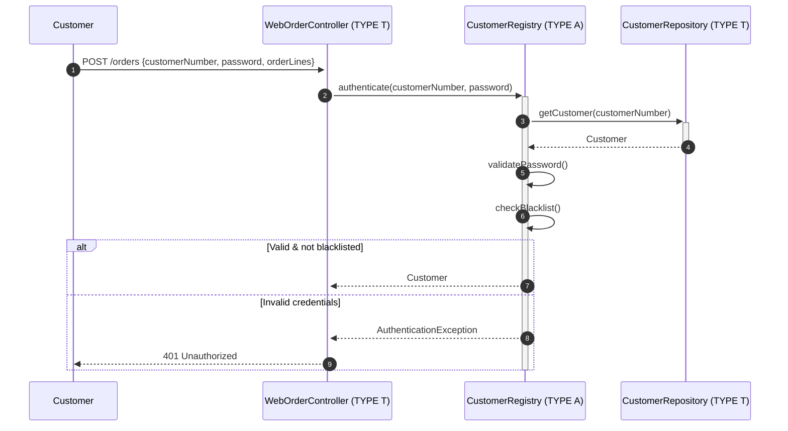
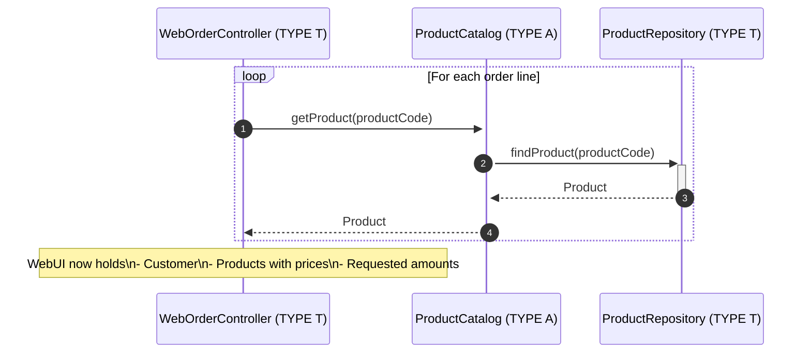
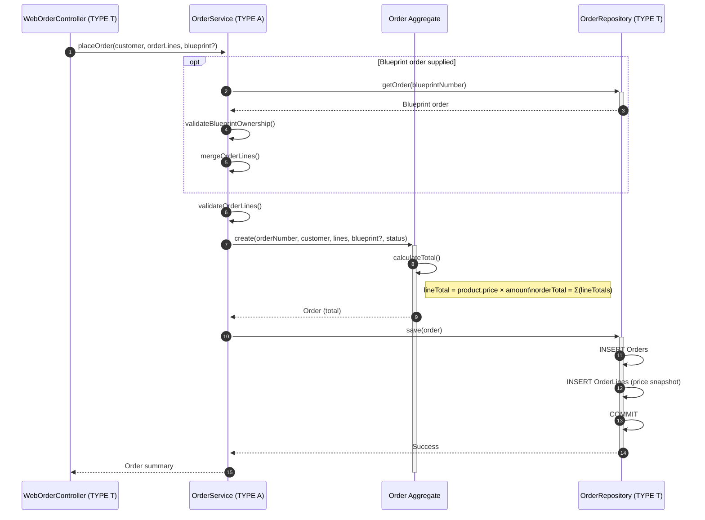
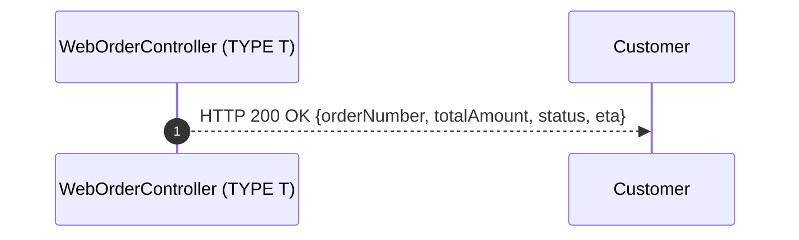
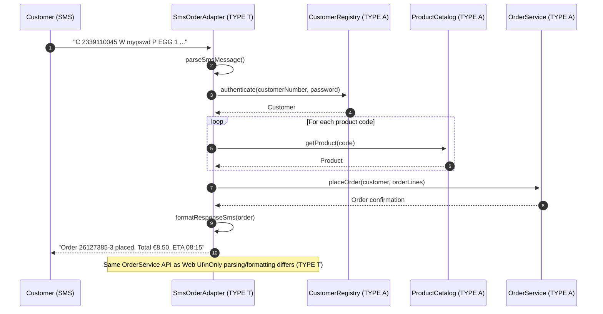

# Order Submission Workflow - Component Cooperation & Data Exchange

The workflow is now split into focused sequence diagrams so each phase stays readable while still showing
the same interactions as the original all-in-one diagram.

## 1. Authentication Phase

## 2. Product Retrieval Phase

## 3. Order Placement Phase

## 4. Response Phase

## 5. Data Exchange Summary

- Customer → WebUI: HTTP POST JSON {customerNumber, password, orderLines, blueprintOrderNumber?}
- WebUI → CustomerRegistry: Domain objects (customerNumber VO, password)
- WebUI → ProductCatalog: productCode queries
- WebUI → OrderService: customer aggregate + order lines with product references
- OrderService → OrderRepository: Order aggregate (order, lines, price snapshot)
- All TYPE T components translate to/from TYPE A domain objects

---

## Alternative Flow: SMS Order Submission

---

**Key Insights**

1. Component cooperation stays identical to the previous version, but each phase is now isolated for clarity.
2. Technology adapters (TYPE T) only translate data; all business rules remain inside TYPE A services.
3. Price snapshots are persisted per line to keep historical accuracy even when catalog prices change.
4. Transactions surround order persistence to guarantee consistency.
