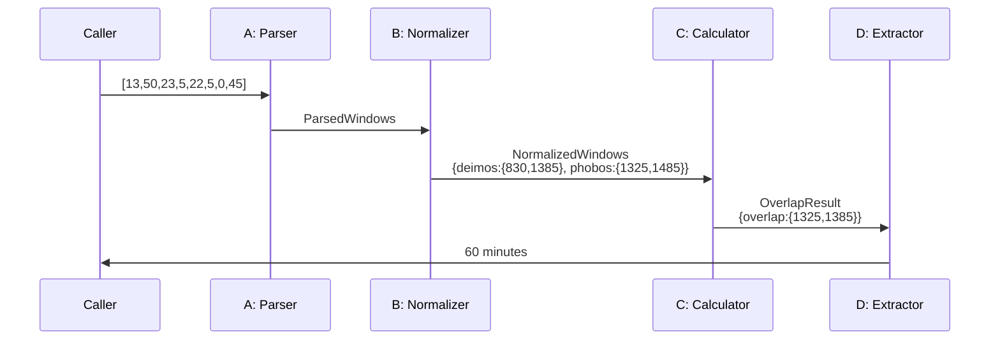

# Exercise 3: Mars Moons Application Core

## Problem Description

Calculate the time (in minutes) when both Mars moons (Deimos and Phobos) are jointly visible. The system receives 8
integers representing visibility windows for each moon:
`[D_start_h, D_start_m, D_end_h, D_end_m, P_start_h, P_start_m, P_end_h, P_end_m]`. The application core must parse
these values, validate times, calculate the overlap between the two windows, and return the overlap duration in minutes.
Input validation (e.g., checking array length) is outside the application core.

**Example:** Input `D[13:91, 23:05] P[22:05, 24:45]` (represented as 8 integers) should return the minutes when both
moons are visible simultaneously.

---

## Component Design (A → B → C → D)

| ID    | Name                 | Job Description                                                           | Input                                                 | Output                                                                                                                                                                     |
|-------|----------------------|---------------------------------------------------------------------------|-------------------------------------------------------|----------------------------------------------------------------------------------------------------------------------------------------------------------------------------|
| **A** | TimeWindowParser     | Parse 8 integers into structured moon visibility windows                  | `int[8]`<br/>Example: `[13, 50, 23, 5, 22, 5, 0, 45]` | `ParsedWindows { deimos: TimeWindow, phobos: TimeWindow }`<br/>where `TimeWindow = {start_h, start_m, end_h, end_m}`                                                       |
| **B** | TimeWindowNormalizer | Validate time values and convert to absolute minute offsets from midnight | `ParsedWindows`                                       | `NormalizedWindows { deimos: MinuteRange, phobos: MinuteRange }`<br/>where `MinuteRange = {start_min, end_min}`<br/>Example: `{deimos: {830, 1385}, phobos: {1325, 1485}}` |
| **C** | OverlapCalculator    | Calculate intersection of two minute ranges                               | `NormalizedWindows`                                   | `OverlapResult { overlap: MinuteRange or null }`<br/>Example: `{overlap: {1325, 1385}}`                                                                                    |
| **D** | DurationExtractor    | Extract duration in minutes (or 0 if no overlap)                          | `OverlapResult`                                       | `int` (minutes)<br/>Example: `60`                                                                                                                                          |

---

## Component Details

### A: TimeWindowParser

**Responsibility:** Split 8-integer array into two structured time windows (no validation).

**Logic:**

```
deimos = TimeWindow(input[0], input[1], input[2], input[3])
phobos = TimeWindow(input[4], input[5], input[6], input[7])
```

---

### B: TimeWindowNormalizer

**Responsibility:** Validate time values (0 ≤ hour ≤ 23, 0 ≤ min ≤ 59) and convert to absolute minutes from midnight.
Handle midnight crossing (if end < start, add 1440 minutes).

**Logic:**

```
validate(hour: 0-23, minute: 0-59)
start_minutes = start_h * 60 + start_m
end_minutes = end_h * 60 + end_m
if end_minutes < start_minutes: end_minutes += 1440
```

---

### C: OverlapCalculator

**Responsibility:** Calculate intersection of two minute ranges.

**Logic:**

```
overlap_start = max(deimos.start, phobos.start)
overlap_end = min(deimos.end, phobos.end)
if overlap_start < overlap_end: return {overlap_start, overlap_end}
else: return null
```

---

### D: DurationExtractor

**Responsibility:** Convert minute range to duration integer.

**Logic:**

```
if overlap == null: return 0
else: return overlap.end - overlap.start
```

---

## Test Cases

### Component A

| Test | Input                           | Expected Output                               |
|------|---------------------------------|-----------------------------------------------|
| A-1  | `[13, 50, 23, 5, 22, 5, 0, 45]` | `{deimos: {13,50,23,5}, phobos: {22,5,0,45}}` |
| A-2  | `[0, 0, 1, 30, 2, 15, 3, 45]`   | `{deimos: {0,0,1,30}, phobos: {2,15,3,45}}`   |

### Component B

| Test | Input                                         | Expected Output                                               |
|------|-----------------------------------------------|---------------------------------------------------------------|
| B-1  | `{deimos: {13,50,23,5}, phobos: {22,5,0,45}}` | `{deimos: {830,1385}, phobos: {1325,1485}}`                   |
| B-2  | `{deimos: {23,0,1,0}, phobos: {22,0,23,30}}`  | `{deimos: {1380,1500}, phobos: {1320,1410}}` (midnight cross) |

### Component C

| Test | Input                                       | Expected Output                |
|------|---------------------------------------------|--------------------------------|
| C-1  | `{deimos: {830,1385}, phobos: {1325,1485}}` | `{overlap: {1325,1385}}`       |
| C-2  | `{deimos: {100,200}, phobos: {300,400}}`    | `{overlap: null}` (no overlap) |

### Component D

| Test | Input                    | Expected Output |
|------|--------------------------|-----------------|
| D-1  | `{overlap: {1325,1385}}` | `60`            |
| D-2  | `{overlap: null}`        | `0`             |

---

## Ambiguities & Assumptions

**Ambiguity 1:** Invalid time values (e.g., 25:00 or 13:91)

- **Assumption:** Component B validates and throws error; Component A passes through raw values

**Ambiguity 2:** Midnight crossing (e.g., 23:00 to 01:00)

- **Assumption:** If end_time < start_time in minutes, assume midnight crossing and add 1440 minutes to end

**Ambiguity 3:** Zero overlap

- **Assumption:** Component C returns null, Component D converts to 0

**Ambiguity 4:** Input array length

- **Assumption:** Precondition that array has exactly 8 integers (validated outside core)

**Ambiguity 5:** Multiple overlaps in 24 hours

- **Assumption:** Out of scope for minimal core; assumes single continuous window per moon

---

## Sequence Diagram



---

## End-to-End Example

**Input:** `[13, 50, 23, 5, 22, 5, 0, 45]`

**Flow:**

1. **A:** Parse → `{deimos: {13,50,23,5}, phobos: {22,5,0,45}}`
2. **B:** Normalize → `{deimos: {830,1385}, phobos: {1325,1485}}` (phobos crosses midnight: 0:45 → 1485)
3. **C:** Calculate → `{overlap: {1325,1385}}` (max(830,1325)=1325, min(1385,1485)=1385)
4. **D:** Extract → `60` (1385 - 1325)

**Result:** Both moons jointly visible for 60 minutes.

---

## Design Rationale

**Why 4 components?**

- A: Parsing (transform representation)
- B: Validation + Normalization (ensure correctness)
- C: Business logic (calculate overlap)
- D: Output formatting

**Why this split?**

- Each has single responsibility
- B validates early (fail fast)
- Each independently testable
- Easy to extend (e.g., add timezone support in B only)

**Estimated code:** ~40-50 lines total (A: 8, B: 25, C: 8, D: 3)
