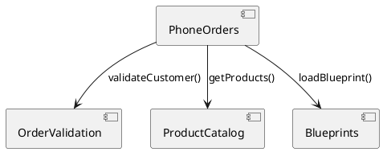

# Requirements Clustering Guide

Step-by-step guide to cluster requirements and derive microservice architecture.

---

## Prerequisites

- Python 3.8 or higher
- OpenAI API key ([get one here](https://platform.openai.com/api-keys))
- (Optional) Pinecone API key for vector storage

---

## Installation

### 1. Navigate to Scripts Directory

```bash
cd WIP/requirements-clustering/scripts
```

### 2. Install Dependencies

```bash
pip install -r requirements.txt
```

### 3. Configure API Keys

```bash
cp requirements.env.example .env
```

Edit `.env` and add your OpenAI API key:

```env
OPENAI_API_KEY=sk-your-actual-key-here
```

---

## Running the Clustering

### Basic Usage

```bash
python cluster_requirements.py
```

### What Happens

1. **Loads Requirements** - From `get_requirements()` function (45 EarlyBird requirements)
2. **Generates Embeddings** - Calls OpenAI API (cached in `output/embeddings.txt`)
3. **Clusters Requirements** - K-Means with 12 clusters (configurable)
4. **Saves Results** - JSON file + PNG visualization

### Output Files

```
output/
├── embeddings.txt       # Cached 1536-dim vectors (reusable)
├── clusters.json        # Requirements grouped by cluster
└── clusters.png         # 2D t-SNE visualization
```

---

## Interpreting Results

### 1. Review `clusters.json`

Example structure:

```json
{
  "Cluster 0": [
    "The system must store one predefined address per customer for delivery."
  ],
  "Cluster 1": [
    "Customers must be able to place orders only over the phone.",
    "Customers must call the company number and provide their customer number.",
    "The system must not allow collective orders from several customers."
  ],
  "Cluster 2": [
    "The system must guarantee breakfast delivery in less than 25 minutes...",
    "The system must allow offering prepackaged breakfasts...",
    "Customers must be able to assemble individual breakfasts..."
  ]
}
```

### 2. Check Cluster Cohesion

**Good Cluster (Cluster 1 - Phone Ordering):**
- All requirements about phone-based order placement
- Semantically related
- Clear domain boundary

**Weak Cluster (Needs Review):**
- Requirements from different domains
- No clear theme
- May need re-clustering or manual split

### 3. Examine Visualization


**What to Look For:**
- **Tight clusters:** Good semantic cohesion
- **Overlapping clusters:** May need fewer clusters or manual review
- **Isolated points:** Outliers or unique requirements

---

## Tuning the Clustering

### Adjust Number of Clusters

Edit `cluster_requirements.py`:

```python
num_clusters = 8  # Try different values: 5, 8, 12, 15
clusters = cluster_embeddings(embeddings, requirements, num_clusters)
```

**Guidelines:**
- **Too few clusters (3-5):** Overly broad microservices (harder to maintain)
- **Too many clusters (20+):** Too granular (coordination overhead)
- **Sweet spot (8-15):** Depends on system size

### Use Custom Requirements

Replace `get_requirements()` with file loading:

```python
def get_requirements():
    """Load requirements from JSON file."""
    with open('../examples/my-requirements.json', 'r') as f:
        data = json.load(f)
    return data['requirements']
```

Example JSON format:

```json
{
  "project": "MyApp",
  "requirements": [
    "User must be able to log in with email and password",
    "System must send password reset emails",
    "Admin must be able to create new users"
  ]
}
```

---

## Naming Clusters (Human Step)

After reviewing clusters, give each a meaningful name:

| Cluster ID | Name | Description |
|------------|------|-------------|
| 0 | Address Management | Customer delivery addresses |
| 1 | Phone Orders | Phone-based order placement |
| 2 | Product Catalog | Breakfast products & composition |
| 3 | Order Validation | Customer authentication, order rules |
| 4 | Blueprints | Saved order templates |
| 5 | Invoicing & Confirmation | Invoice generation, signatures |
| 6 | Fulfillment | Packing, itineraries, delivery |
| 7 | Order Lifecycle | Cancel, update, status tracking |
| 8 | Automation | Web-based replacement of manual processes |
| 9 | Web Support | Browser compatibility, unauthenticated search |
| 10 | Product Composition | Prepackaged vs. simple products |
| 11 | Authentication | Customer validation, blacklisting |

---

## Next Steps: From Clusters to Architecture

### 1. Create `ARCHITECTURE.md` per Cluster

For each named cluster, create:

```
WIP/architecture-specs/
├── AddressManagement.ARCHITECTURE.md
├── PhoneOrders.ARCHITECTURE.md
├── ProductCatalog.ARCHITECTURE.md
└── ...
```

Use template: `docs/ARCHITECTURE_TEMPLATE.md`

### 2. Define Interfaces

Identify cross-cluster dependencies:

```
PhoneOrders → OrderValidation (validate customer)
PhoneOrders → ProductCatalog (fetch products)
PhoneOrders → Blueprints (load saved orders)
```

### 3. Specify Blood Types

Classify each interface:

- **A-Type (Application):** `IOrderValidator`, `IProductCatalog`
- **T-Type (Technology):** HTTP controllers, SQL repositories
- **O-Type (Universal):** `IList<T>`, `IRepository<T>`

### 4. Draw Architecture Diagrams

Use PlantUML or similar:



---

## Troubleshooting

### "OpenAI API key not found"

**Solution:** Check `.env` file exists and contains:
```
OPENAI_API_KEY=sk-...
```

### "Rate limit exceeded"

**Solution:** Wait 60 seconds or use cached `embeddings.txt` (already generated)

### "Not enough colors for clusters"

**Solution:** Reduce `num_clusters` or add more colors to `colors` list in `visualize_embeddings()`

### Clusters don't make sense

**Try:**
1. Adjust `num_clusters` (start with 8)
2. Review requirement wording (too generic = poor clustering)
3. Add more requirements (better with 30+ requirements)
4. Try different clustering algorithms (DBSCAN, Hierarchical)

---

## Advanced Topics

### Use Different Embedding Models

Replace `text-embedding-ada-002` with:

- `text-embedding-3-small` (newer, faster)
- `sentence-transformers/all-mpnet-base-v2` (Hugging Face)

### Try DBSCAN (Density-Based Clustering)

```python
from sklearn.cluster import DBSCAN

dbscan = DBSCAN(eps=0.3, min_samples=2, metric='cosine')
clusters = dbscan.fit_predict(embeddings)
```

**Advantage:** Doesn't require pre-set cluster count

### Store in Pinecone for Semantic Search

Once uploaded to Pinecone, you can:

```python
# Find similar requirements
query = "Customer authentication"
query_embedding = oai.embeddings.create(
    model="text-embedding-ada-002",
    input=query
).data[0].embedding

results = pinecone_index.query(
    vector=query_embedding,
    top_k=5,
    include_values=True
)
```

---

## References

- [OpenAI Embeddings Guide](https://platform.openai.com/docs/guides/embeddings)
- [Scikit-learn Clustering](https://scikit-learn.org/stable/modules/clustering.html)
- [t-SNE Visualization](https://scikit-learn.org/stable/modules/generated/sklearn.manifold.TSNE.html)
- [Pinecone Vector Database](https://docs.pinecone.io/)

---

**Next:** See `ARCHITECTURE_TEMPLATE.md` to start writing specs for each cluster.
