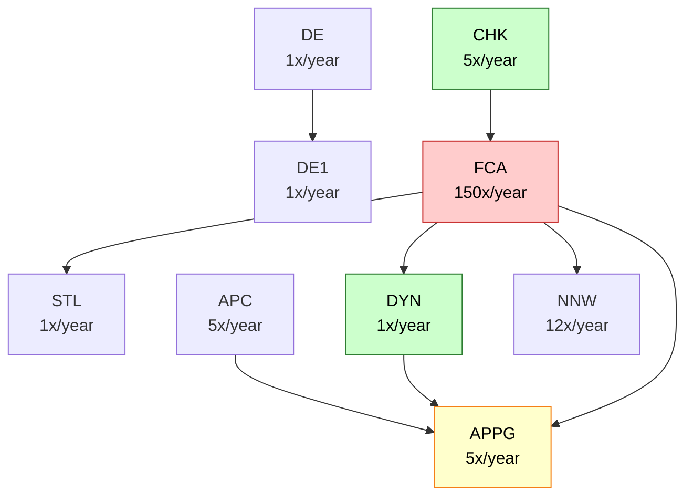

# Exercise 2: Climate Model Architecture Analysis

## Subsystems Table

| Subsystem | Description                                | Changes/Year | Uses                |
|-----------|--------------------------------------------|--------------|---------------------|
| APPG      | Air pressure & population data             | 5x           | DE, CHK             |
| APC       | Checks air pressure data, converts to JSON | 5x           | APPG                |
| DE        | Solves differential equations              | 1x           | DE1                 |
| DE1       | Solves first-order differential equations  | 1x           | none                |
| STL       | Statistics library                         | 1x           | none                |
| DYN       | Models aerodynamics laws                   | 1x           | APPG                |
| NNW       | Neural network for forecasting             | 12x          | none                |
| FCA       | Performs forecasts                         | 150x         | APPG, DYN, STL, NNW |
| CHK       | Checks forecast plausibility               | 5x           | FCA                 |

---

## Structural Weaknesses

### 1. SDP (Stable Dependencies Principle) Violations

**CHK → FCA dependency:**

- CHK changes 5x/year (relatively stable)
- FCA changes 150x/year (extremely unstable)
- **Problem:** Stable component depends on component that changes 30x more frequently
- Every FCA change risks breaking CHK, forcing regression testing and potential code changes
- CHK cannot be stable when its primary dependency is highly volatile

**DYN → APPG dependency:**

- DYN changes 1x/year (very stable - core physics)
- APPG changes 5x/year (data source, 5x more volatile)
- **Problem:** Stable aerodynamics model forced to adapt to data format changes
- Physics algorithms shouldn't depend on data representation

---

### 2. CCP (Common Closure Principle) Issue

**FCA change frequency mismatch:**

- FCA: 150 changes/year
- Its dependencies: APPG (5x), DYN (1x), STL (1x), NNW (12x)
- **Problem:** FCA changes far more frequently than its dependencies
- Suggests FCA has internal responsibilities unrelated to its dependencies
- Should be split: algorithm changes vs. data adapter changes vs. orchestration

---

### 3. High Fan-In Risk: APPG Bottleneck

**APPG used by:** APC, DYN, FCA (indirectly CHK)

- **Problem:** Changes to APPG data format affect 3-4 components
- No abstraction layer isolates consumers from data source changes
- 5 changes/year × 3-4 consumers = 15-20 component updates/year

---

### 4. ISP (Interface Segregation) Potential Violation

**APPG provides:** "Air pressure AND population growth data"

- **FCA likely needs:** Only air pressure for weather forecasts
- **Problem:** If FCA doesn't use population data, it's forced to depend on unnecessary functionality
- Changes to population data methods affect FCA even though it doesn't use them

---

### 5. NNW Isolation Waste

- NNW changes 12x/year but only used by FCA
- If it's a general neural network library, should be stable (~1x/year)
- High change rate suggests it's tightly coupled to FCA's forecasting logic
- Should split: general NN library (stable) vs. forecast-specific adapter (volatile)

---

## Dependency Diagram

**Legend:** Green = stable (1x), Yellow = moderate (5-12x), Red = volatile (150x)

---

## Expensive Change Scenarios

### 1. Modify APPG Data Format

**Example:** Change from CSV to JSON format

**Impact:**

- **Direct:** APC, DYN, FCA all must adapt to new format
- **Indirect:** CHK must revalidate (depends on FCA which uses APPG)
- **Total affected:** 4 components
- **Why expensive:** No abstraction layer means all consumers directly coupled to format
- **Cost:** Every APPG change (5x/year) propagates to 3-4 components

---

### 2. Update FCA Forecasting Algorithm

**Example:** Replace ML model with new approach

**Impact:**

- **Direct:** FCA implementation changes
- **Cascade:** CHK depends on FCA directly (no stable interface)
- Every FCA algorithm change requires CHK regression testing
- Output format changes may require CHK code modifications
- **Cost:** 150 FCA changes/year → 150 CHK test cycles minimum
- Some changes (~20%) require CHK code updates = 30 additional changes/year

---

### 3. Replace NNW with Different ML Library

**Example:** Migrate from custom NN to TensorFlow

**Impact:**

- **Direct:** Complete NNW rewrite
- **Cascade:** FCA uses NNW directly (no abstraction)
- Must rewrite FCA's NNW integration code
- Must retrain all forecast models
- CHK must recalibrate validation rules (different ML = different outputs)
- **Why expensive:** Technology choice (NNW library) is tightly coupled to business logic (FCA forecasting)
- **Estimated effort:** 400-600 developer hours

---

## Requirements Ambiguities

**Ambiguity 1:** What does "APPG used by DE, CHK" mean?

- **Assumption:** Forward dependencies only (DE and CHK consume APPG data), not callbacks

**Ambiguity 2:** Why does FCA change 150x/year?

- **Assumption:** Mix of algorithm improvements, data format adaptations, and bug fixes
- **Need:** Categorization to determine if split is needed

**Ambiguity 3:** Does APC modify APPG data?

- **Assumption:** APC is a validator/converter that reads APPG, doesn't write back

**Ambiguity 4:** Does CHK modify FCA?

- **Assumption:** Read-only dependency, CHK validates FCA output without modifying it

---

## Recommended Refactoring

1. **Extract stable interfaces:**
    - `IClimateDataProvider` (implemented by APPG)
    - `IForecastEngine` (implemented by FCA)

2. **Invert CHK → FCA dependency:**
    - FCA depends on `IForecastValidator` interface
    - CHK implements the interface (becomes plugin)

3. **Split FCA by change reason:**
    - ForecastOrchestrator (stable, 5x/year)
    - ForecastAlgorithms (volatile, 100x/year)
    - DataAdapters (moderate, 45x/year)

4. **Isolate APPG consumers via interface:**
    - DYN → `IClimateDataProvider`
    - FCA → `IClimateDataProvider`
    - Can swap APPG implementation without affecting consumers
