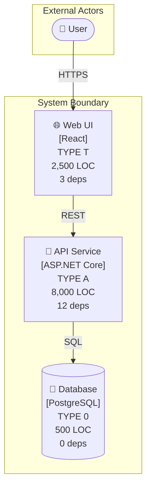
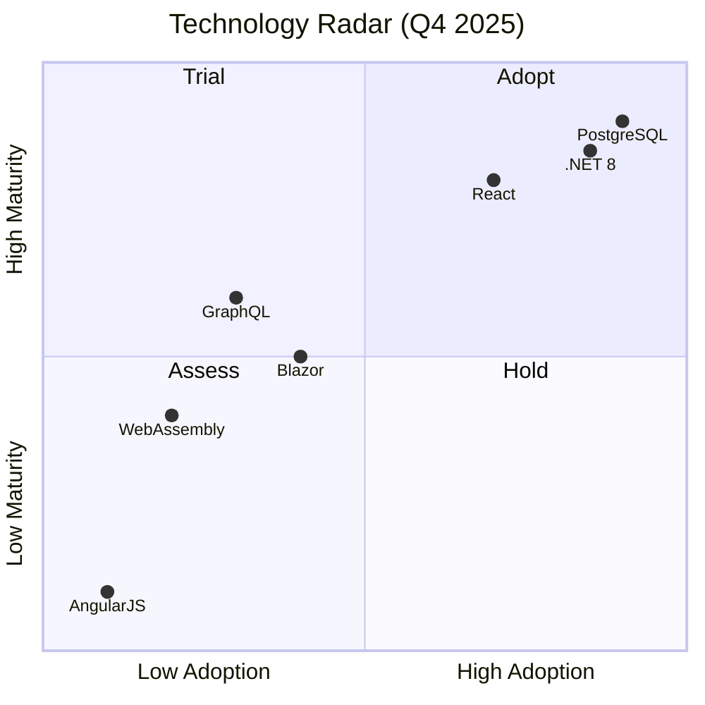

# EA6: Empirical Architecture Framework

**Exercise ID:** ArchitecturalFramework_EA6
**Date:** November 13, 2025
**Foundation:** Synthesizes C4 Model + arc42 + Empirical Software Engineering (1968-2025)

---

## Executive Summary

**EA6** (Empirical Architecture Framework) is a practical, evidence-based architectural documentation framework that
combines the best of C4 Model and arc42, while adding critical dimensions missing from both.

**Name Origin:**

- **E**mpirical - Evidence-based, measurable, grounded in reality
- **A**rchitecture - Software system design
- **6** - Six core views (not arbitrary documentation)

**Core Philosophy:**

- **Evidence over Aspiration** - Document actual state, not wishes
- **Change over Structure** - Optimize for evolution, not static perfection
- **Constraints over Guidelines** - Automated checks, not suggestions
- **Impact over Completeness** - Document what matters for decisions

---

## 1. Framework Composition

### 1.1 From C4 Model (2 of 4 levels)

| C4 Level               | Included | Purpose                                       | Why Included                                |
|------------------------|----------|-----------------------------------------------|---------------------------------------------|
| **C1: System Context** | ✅        | Shows system boundary and external actors     | Essential for scoping                       |
| **C2: Container**      | ✅        | Shows deployment units and technology choices | Critical for change impact                  |
| C3: Component          | ❌        | Internal component structure                  | Redundant with V2 (Dependency Architecture) |
| C4: Code               | ❌        | Class diagrams                                | Too low-level, managed by IDE               |

**Rationale for Exclusions:**

- **C3 (Component):** EA6's V2 (Dependency Architecture) provides same information with added constraint checking
- **C4 (Code):** Code-level diagrams belong in IDE explorers, not architecture docs; they go stale immediately

### 1.2 From arc42 (6 of 12 chapters)

| arc42 Chapter                | Included | Purpose                              | Why Included                          |
|------------------------------|----------|--------------------------------------|---------------------------------------|
| **1. Introduction & Goals**  | ✅        | Purpose, quality goals, stakeholders | Foundation for all decisions          |
| 2. Constraints               | ❌        | Technical/organizational limits      | Captured in V4 (Quality Dashboard)    |
| **3. Context & Scope**       | ✅        | Business and technical context       | Complements C1 (System Context)       |
| 4. Solution Strategy         | ❌        | High-level approach                  | Captured in V6 (Evolution Roadmap)    |
| **5. Building Blocks**       | ✅        | Component decomposition              | Complements C2 (Container)            |
| 6. Runtime View              | ❌        | Dynamic behavior                     | Replaced by V3 (Change Impact Model)  |
| 7. Deployment View           | ❌        | Infrastructure                       | Merged into C2 (Container)            |
| **8. Cross-Cutting**         | ✅        | Security, logging, error handling    | Essential patterns                    |
| **9. Decisions**             | ✅        | Architecture Decision Records (ADRs) | Critical for understanding rationale  |
| **10. Quality Requirements** | ✅        | Measurable quality goals             | EA6 requires metrics, not aspirations |
| 11. Risks & Debt             | ❌        | Problems and technical debt          | Captured in V4 (Quality Dashboard)    |
| 12. Glossary                 | ❌        | Domain terminology                   | Should be in requirements docs        |

**Rationale for Exclusions:**

- **Ch 2, 11:** Merged into V4 (Quality & Risk Dashboard) with actual metrics
- **Ch 4:** Replaced by V6 (Evolution Roadmap) showing actual trajectory
- **Ch 6:** Replaced by V3 (Change Impact Model) with scenario-based analysis
- **Ch 7:** Merged into C2 (Container) using deployment annotations
- **Ch 12:** Glossary belongs in requirements, not architecture

### 1.3 Innovative Additions (Beyond C4 + arc42)

EA6 adds **7 critical dimensions** not covered by C4 or arc42:

| Addition                          | Purpose                                                          | Missing From                                      |
|-----------------------------------|------------------------------------------------------------------|---------------------------------------------------|
| **1. Allowed-to-Use Matrix**      | Binary permission matrix (who may depend on whom)                | C4 shows "what calls what", arc42 doesn't enforce |
| **2. Change Impact Heatmap**      | Blast radius per scenario (which components affected)            | Neither provides scenario-based impact analysis   |
| **3. Sustainability View**        | Runtime footprint (CPU/GPU/memory/storage) per component         | Neither labels components by resource consumption |
| **4. FinOps View**                | Cost drivers and scaling behavior per component                  | Neither attaches cost to architecture elements    |
| **5. Test Architecture**          | Test coverage, test types, testing strategy per component        | Both frameworks completely ignore testing         |
| **6. Principle Adherence Matrix** | Which SOLID/component principles each component follows          | Neither validates architectural principles        |
| **7. Evolution Roadmap**          | Component lifecycle (stable/evolving/deprecated), migration plan | Neither shows temporal dimension or future state  |

---

## 2. The Six Core Views

### V1: System Topology

**Purpose:** WHAT components exist, WHERE they run, WHO uses them
**Sources:** C4 C1 (System Context) + C4 C2 (Container) + arc42 Ch3 (Context)

**Contents:**

- System boundary and external actors
- Deployable containers (services, databases, queues)
- Technology stack per container
- Physical deployment topology
- Communication protocols

**Visual Semantics:**

- **Size (Width):** Lines of Code (LOC) - bigger box = more code
- **Size (Height):** Number of Dependencies (fan-in + fan-out)
- **Color:** Blood Type (🟦 T = Technical, 🟪 A = Application, 🟧 0 = Core)
- **Border Style:**
    - Solid: Stable (< 5 changes/year)
    - Dashed: Evolving (5-20 changes/year)
    - Dotted: Volatile (> 20 changes/year)

**Example (Mermaid):**



---

### V2: Dependency Architecture

**Purpose:** Dependency graph + constraint enforcement + violation detection
**Sources:** arc42 Ch5 (Building Blocks) + Allowed-to-Use Matrix + C4 C3 (Component) concepts

**Contents:**

- Component dependency graph (who depends on whom)
- Allowed-to-Use Matrix (binary permission matrix)
- Actual vs Allowed dependencies
- Violation detection (red arrows)
- Coupling metrics (arrow thickness)
- Blood type dependency rules

**Visual Semantics:**

- **Arrow Style:**
    - Solid: Compile-time dependency (imports, direct calls)
    - Dashed: Runtime dependency (events, messages, pub/sub)
- **Arrow Thickness:**
    - Thick (3px): High coupling (> 10 method calls)
    - Medium (2px): Medium coupling (3-10 calls)
    - Thin (1px): Low coupling (1-2 calls)
- **Arrow Color:**
    - 🟩 Green: Allowed dependency (passes Allowed-to-Use Matrix)
    - 🟥 Red: VIOLATION (forbidden dependency)
- **Badges:**
    - ⚠️ Technical debt
    - 🔒 Security boundary crossed
    - 🔄 Circular dependency detected

**Allowed-to-Use Matrix Example:**
| | K1 | K2 | K3 | K4 | K5 |
|-----|----|----|----|----|-----|
| **K1** | — | ✗ | ✗ | ✗ | ✗ |
| **K2** | ✗ | — | ✗ | ✗ | ✗ |
| **K3** | ✓ | ✓ | — | ✓ | ✗ |
| **K4** | ✗ | ✗ | ✗ | — | ✓ |
| **K5** | ✗ | ✗ | ✗ | ✗ | — |

**Blood Type Dependency Rules:**

- ✅ A → T (Application may use Technical)
- ✅ A → 0 (Application may use Core)
- ❌ T → A (Technical MUST NOT depend on Application)
- ❌ T → 0 (Technical MUST NOT depend on Core)
- ❌ 0 → * (Core MUST NOT depend on anything)

---

### V3: Change Impact Model

**Purpose:** Blast radius per scenario + runtime behavior + sequence of operations
**Sources:** Change Impact Heatmap + arc42 Ch6 (Runtime View) concepts

**Contents:**

- Change Impact Heatmap (which components affected per scenario)
- Sequence diagrams for critical workflows
- State machines for complex entities
- Runtime data flows
- Performance hotspots

**Visual Semantics:**

- **Heat Colors:**
    - 🟥 Red (✓✓): High impact - Component requires rework
    - 🟨 Yellow (✓): Medium impact - Minor changes needed
    - 🟩 Green (✗): No impact - Component untouched
- **Size:** Affected Lines of Code (bigger cell = more work)

**Change Impact Heatmap Example:**
| Scenario | K1 | K2 | K3 | K4 | K5 | Estimated Impact (hours) |
|----------|----|----|----|----|-----|--------------------------|
| **Renderer swap** (OpenGL → Vulkan) | 🟩 | 🟥 | 🟨 | 🟩 | 🟩 | 80h |
| **Chess rule change** (variant castling) | 🟩 | 🟩 | 🟩 | 🟥 | 🟨 | 16h |
| **State format change** (add hash) | 🟩 | 🟩 | 🟩 | 🟨 | 🟥 | 12h |
| **Input device change** (add touch) | 🟥 | 🟩 | 🟨 | 🟩 | 🟩 | 24h |

---

### V4: Quality & Risk Dashboard

**Purpose:** Measurable quality metrics + ADRs + technical debt + risks
**Sources:** arc42 Ch9 (Decisions) + Ch10 (Quality) + Ch11 (Risks) + arc42 Ch2 (Constraints)

**Contents:**

- **Architecture Decision Records (ADRs):**
    - Decision ID, Date, Context, Decision, Consequences, Status
- **Quality Metrics (Actual, not goals):**
    - Code coverage: 87% (target: 80%)
    - Cyclomatic complexity: avg 5.2 (target: < 10)
    - Dependency violations: 0 (target: 0)
- **Technical Debt Items:**
    - ID, Description, Component, Cost (hours), Priority
- **Risks & Mitigations:**
    - ID, Risk, Impact, Probability, Mitigation, Status
- **Constraints:**
    - Technology constraints (must use .NET 8)
    - Organizational constraints (2-week sprints)
    - Convention constraints (must follow C# guidelines)

**Visual Semantics:**

- **Traffic Lights:**
    - 🟢 Green: Meets target
    - 🟡 Yellow: Warning (within 10% of target)
    - 🔴 Red: Violation (exceeds target)
- **Trend Arrows:**
    - 📈 Improving
    - ➡️ Stable
    - 📉 Degrading
- **Priority Badges:**
    - 🔥 Critical (blocks release)
    - ⚠️ High (should fix this sprint)
    - ℹ️ Medium (backlog)
    - 💤 Low (nice to have)

**ADR Example:**

```markdown
## ADR-003: Use Hexagonal Architecture for Application Core

**Date:** 2025-10-15
**Status:** Accepted
**Deciders:** Tech Lead, Senior Architect

**Context:**
Need to isolate business logic from UI and database to enable technology migration.

**Decision:**
Implement Ports & Adapters (Hexagonal Architecture) with:

- Application Core contains business logic (TYPE A)
- Adapters translate to/from external systems (TYPE T)
- Interfaces define ports (contracts)

**Consequences:**

- ✅ Core is testable without real database
- ✅ Can replace UI (Web → Mobile) without changing core
- ❌ More interfaces to maintain
- ❌ Slight learning curve for new developers

**Alternatives Considered:**

1. Layered Architecture - Rejected (core still depends on infrastructure abstractions)
2. Monolithic - Rejected (impossible to swap technologies)
```

---

### V5: Resource & Cost Model

**Purpose:** Runtime footprint + cost drivers + performance budgets
**Sources:** Sustainability View + FinOps View (both NEW)

**Contents:**

- **Resource Consumption per Component:**
    - Always-on vs on-demand
    - CPU/GPU intensity (idle, average, peak)
    - Memory footprint
    - Storage growth rate
    - Network bandwidth
- **Cost Drivers:**
    - What makes this component expensive at scale?
    - Does cost scale per-user, per-request, or fixed?
- **Performance Budgets:**
    - Response time targets (P50, P95, P99)
    - Throughput targets (requests/sec)
    - Resource limits (max CPU%, max memory)
- **Carbon Footprint:**
    - Estimated CO₂ per 1,000 requests
    - Renewable energy usage

**Visual Semantics:**

- **Size:** Resource consumption (bigger box = more resources)
- **Color (Cost Tier):**
    - 🟢 Green: Low cost (< $10/month at scale)
    - 🟡 Yellow: Medium cost ($10-$100/month)
    - 🟠 Orange: High cost ($100-$1,000/month)
    - 🔴 Red: Very high cost (> $1,000/month)
- **Icons:**
    - 💰 High cost driver
    - 🔥 Performance hotspot
    - 📈 Growing rapidly
    - ♻️ Optimized for efficiency

**Example Table:**
| Component | Mode | CPU | Memory | Storage Growth | Cost/Month | Scaling |
|-----------|------|-----|--------|----------------|------------|---------|
| K1: InputAdapter | Always-on | Low | 50MB | None | $2 | Fixed |
| K2: RenderEngine | Active | GPU-heavy | 200MB | None | $15 | Per session |
| K3: Controller | On-demand | Medium | 100MB | None | $5 | Per request |
| K4: AnalysisService | On-demand | **High** | 500MB | None | **$80** | Per analysis |
| K5: PositionStore | Always | Low | 100MB | **High** | **$50** | Per game |

---

### V6: Evolution Roadmap

**Purpose:** Component lifecycle + migration plan + technology radar
**Sources:** NEW (not in C4 or arc42) + arc42 Ch4 (Solution Strategy) concepts

**Contents:**

- **Component Lifecycle Status:**
    - 🟢 Stable: Mature, rarely changes
    - 🟡 Evolving: Active development
    - 🟠 Deprecated: Planned for removal
    - 🔴 Legacy: Must be replaced
- **Migration Timeline:**
    - What will be replaced?
    - When will migration happen?
    - What is the replacement?
- **Technology Radar:**
    - Adopt: Technologies we're committing to
    - Trial: Technologies we're experimenting with
    - Assess: Technologies we're watching
    - Hold: Technologies we're phasing out
- **Refactoring Backlog:**
    - Planned refactorings with priority and effort
- **Architecture Vision:**
    - Target architecture in 6 months, 1 year, 2 years

**Visual Semantics:**

- **Timeline Placement:** X-axis = time (now → future)
- **Color (Maturity):**
    - 🟢 Green: Stable
    - 🟡 Yellow: Evolving
    - 🟠 Orange: Deprecated
    - 🔴 Red: Legacy
- **Arrow Direction:**
    - ➡️ Migration path
    - ⬆️ Technology adoption
    - ⬇️ Technology deprecation

**Technology Radar Example:**



---

## 3. Visual Semantic System (Complete Specification)

### 3.1 Color Semantics

**Blood Type Colors (from Architecture Blood Types):**
| Color | Type | Stability | Change Driver | Example |
|-------|------|-----------|---------------|---------|
| 🟦 Blue | TYPE T (Technical) | Unstable | Technology evolution | InputAdapter, RenderEngine, Database |
| 🟪 Purple | TYPE A (Application) | Stable | Business rules | OrderService, AnalysisService |
| 🟧 Orange | TYPE 0 (Core) | Universal | Rarely changes | Value Objects, Domain Entities |

**Status Colors (from Quality Metrics):**
| Color | Status | Meaning | Example |
|-------|--------|---------|---------|
| 🟢 Green | Compliant | Meets all targets | Coverage 90% (target 80%) |
| 🟡 Yellow | Warning | Approaching limit | Coverage 82% (target 80%) |
| 🔴 Red | Violation | Exceeds limit | Coverage 65% (target 80%) |

**Cost Colors (from FinOps View):**
| Color | Tier | Cost/Month | Example |
|-------|------|------------|---------|
| 🟢 Green | Low | < $10 | InputAdapter |
| 🟡 Yellow | Medium | $10-$100 | RenderEngine |
| 🟠 Orange | High | $100-$1,000 | AnalysisService |
| 🔴 Red | Very High | > $1,000 | ML Training Service |

### 3.2 Frame Style Semantics

**Border Style (Component Stability):**
| Style | Stability | Changes/Year | Example |
|-------|-----------|--------------|---------|
| **Solid** | Stable | < 5 | Core domain entities |
| **Dashed** | Evolving | 5-20 | Active features |
| **Dotted** | Volatile | > 20 | Experimental APIs |

**Border Thickness:**
| Thickness | Meaning | Example |
|-----------|---------|---------|
| Thick (4px) | Security boundary | Authentication Service |
| Medium (2px) | Subsystem boundary | K1, K2, K3, K4, K5 |
| Thin (1px) | Component boundary | Internal services |

### 3.3 Size Semantics

**Width:**

- Proportional to **Lines of Code (LOC)**
- Small: < 500 LOC
- Medium: 500-2,000 LOC
- Large: 2,000-10,000 LOC
- Very Large: > 10,000 LOC

**Height:**

- Proportional to **Number of Dependencies** (fan-in + fan-out)
- Short: 0-3 dependencies
- Medium: 4-10 dependencies
- Tall: 11-20 dependencies
- Very Tall: > 20 dependencies

### 3.4 Arrow Semantics

**Arrow Style (Dependency Type):**
| Style | Type | Coupling | Example |
|-------|------|----------|---------|
| **Solid** | Compile-time | Strong | `using`, `import`, direct call |
| **Dashed** | Runtime | Weak | Events, pub/sub, message queue |

**Arrow Thickness (Coupling Strength):**
| Thickness | Strength | Calls | Example |
|-----------|----------|-------|---------|
| Thick (3px) | High | > 10 | Controller → Service (many methods) |
| Medium (2px) | Medium | 3-10 | Service → Repository (CRUD) |
| Thin (1px) | Low | 1-2 | Observer → Event (one callback) |

**Arrow Color (Constraint Compliance):**
| Color | Status | Meaning | Action |
|-------|--------|---------|--------|
| 🟢 Green | Allowed | Passes Allowed-to-Use Matrix | None |
| 🟡 Yellow | Risky | Allowed but creates high coupling | Review |
| 🔴 Red | VIOLATION | Forbidden by Allowed-to-Use Matrix | **MUST FIX** |

### 3.5 Icon/Badge Semantics

| Icon | Meaning                  | Appears On                                       |
|------|--------------------------|--------------------------------------------------|
| ⚠️   | Technical debt item      | Component with known issues                      |
| 🔒   | Security boundary        | Components handling authentication/authorization |
| 💰   | High cost driver         | Components expensive to run at scale             |
| 🔥   | Performance hotspot      | Components with P95 > 500ms                      |
| 📈   | Growing rapidly          | Components with > 20% LOC growth/month           |
| ♻️   | Optimized for efficiency | Components meeting all performance budgets       |
| 🧪   | Under test               | Components with < 80% coverage                   |
| 🚧   | Work in progress         | Components actively being refactored             |
| ☠️   | Deprecated               | Components planned for removal                   |
| ✅    | Principle-compliant      | Components passing all SOLID checks              |

---

## 4. Architecture Review Methodology

### 4.1 Review Types

**Type 1: Dependency Review**

- **Frequency:** Weekly (automated)
- **View:** V2 (Dependency Architecture)
- **Checks:**
    - ✅ All dependencies allowed by Allowed-to-Use Matrix?
    - ✅ No circular dependencies?
    - ✅ Blood type rules followed?
    - ✅ Coupling metrics within thresholds?
- **Output:** Pass/Fail + list of violations

**Type 2: Change Impact Review**

- **Frequency:** Before major changes
- **View:** V3 (Change Impact Model)
- **Checks:**
    - ✅ Estimated impact matches actual components?
    - ✅ Blast radius contained to expected subsystems?
    - ✅ No unexpected cascading changes?
- **Output:** Impact report with affected components

**Type 3: Quality Review**

- **Frequency:** Monthly
- **View:** V4 (Quality & Risk Dashboard)
- **Checks:**
    - ✅ All quality metrics green or yellow?
    - ✅ Technical debt < 10% of total effort?
    - ✅ All critical risks mitigated?
    - ✅ ADRs up to date?
- **Output:** Quality scorecard

**Type 4: Cost Review**

- **Frequency:** Quarterly
- **View:** V5 (Resource & Cost Model)
- **Checks:**
    - ✅ Actual costs within budget?
    - ✅ Performance budgets met?
    - ✅ Carbon footprint decreasing?
- **Output:** Cost report with optimization recommendations

**Type 5: Evolution Review**

- **Frequency:** Bi-annually
- **View:** V6 (Evolution Roadmap)
- **Checks:**
    - ✅ Migration timeline on track?
    - ✅ Deprecated components removed?
    - ✅ Technology radar up to date?
- **Output:** Evolution status report

### 4.2 Review Checklist

Before merging any architectural change, verify:

**Topology (V1):**

- [ ] New containers added to C2 diagram?
- [ ] Technology stack documented?
- [ ] Deployment topology updated?

**Dependencies (V2):**

- [ ] Dependency added to Allowed-to-Use Matrix?
- [ ] Blood type rules followed?
- [ ] No circular dependencies created?
- [ ] Coupling metrics acceptable?

**Change Impact (V3):**

- [ ] Impact heatmap updated for new scenarios?
- [ ] Sequence diagrams reflect new flow?
- [ ] Performance impact estimated?

**Quality (V4):**

- [ ] ADR created for significant decisions?
- [ ] Quality metrics still green?
- [ ] New technical debt items logged?
- [ ] Risks assessed and mitigated?

**Resources (V5):**

- [ ] Cost impact estimated?
- [ ] Performance budget defined?
- [ ] Scaling behavior documented?

**Evolution (V6):**

- [ ] Component lifecycle status updated?
- [ ] Migration plan adjusted if needed?
- [ ] Technology radar updated?

### 4.3 Automated Checks

EA6 encourages **automated enforcement** of architectural constraints:

```csharp
[Test]
public void VerifyDependencyConstraints()
{
    var allowedToUseMatrix = LoadMatrix();
    var actualDependencies = AnalyzeCodebase();

    foreach (var dep in actualDependencies)
    {
        Assert.IsTrue(
            allowedToUseMatrix.IsAllowed(dep.From, dep.To),
            $"VIOLATION: {dep.From} → {dep.To} is FORBIDDEN"
        );
    }
}
```

---

## 5. Comparison: EA6 vs C4 vs arc42

### 5.1 Feature Matrix

| Feature                    | C4         | arc42       | EA6                    |
|----------------------------|------------|-------------|------------------------|
| **System Context**         | ✅ C1       | ✅ Ch3       | ✅ V1                   |
| **Container View**         | ✅ C2       | ❌           | ✅ V1                   |
| **Component View**         | ✅ C3       | ✅ Ch5       | ✅ V2 (enhanced)        |
| **Code View**              | ✅ C4       | ❌           | ❌ (IDE)                |
| **Quality Goals**          | ❌          | ✅ Ch1, Ch10 | ✅ V4 (with metrics)    |
| **Stakeholders**           | ❌          | ✅ Ch1       | ✅ V1                   |
| **Constraints**            | ❌          | ✅ Ch2       | ✅ V4                   |
| **Cross-Cutting**          | ❌          | ✅ Ch8       | ✅ V4                   |
| **Decisions (ADRs)**       | ❌          | ✅ Ch9       | ✅ V4                   |
| **Runtime View**           | ❌          | ✅ Ch6       | ✅ V3 (scenario-based)  |
| **Deployment**             | ✅ C2       | ✅ Ch7       | ✅ V1                   |
| **Risks & Debt**           | ❌          | ✅ Ch11      | ✅ V4 (measurable)      |
| **Dependency Constraints** | ❌          | ❌           | ✅ V2 (Allowed-to-Use)  |
| **Change Impact**          | ❌          | ❌           | ✅ V3 (Heatmap)         |
| **Resource/Cost**          | ❌          | ❌           | ✅ V5 (FinOps)          |
| **Test Architecture**      | ❌          | ❌           | ✅ V4                   |
| **Evolution Plan**         | ❌          | ❌           | ✅ V6                   |
| **Principle Adherence**    | ❌          | ❌           | ✅ V4                   |
| **Semantic Visuals**       | ⚠️ (basic) | ❌           | ✅ (color, size, frame) |
| **Automated Checks**       | ❌          | ❌           | ✅ (V2 violations)      |

### 5.2 When to Use Each Framework

**Use C4 when:**

- You need quick, lightweight diagrams
- Team is familiar with C4 notation
- You don't need dependency enforcement
- You're documenting simple systems

**Use arc42 when:**

- You need comprehensive documentation
- Stakeholders require traditional architecture docs
- You have time for detailed write-ups
- Compliance requires extensive documentation

**Use EA6 when:**

- You need **evidence-based** architecture documentation
- You want **automated constraint checking**
- You need to track **change impact** and **costs**
- You're optimizing for **evolution** and **maintainability**
- You want architecture reviews to be **measurable**

---

## 6. EA6 Self-Rating

### 6.1 Comparison to Mars & EarlyBird (Currently 7/10)

**Why Mars & EarlyBird are 7/10:**

- ✅ Strong pedagogical value (teach principles well)
- ✅ Clear examples (understandable)
- ✅ Good diagrams (Mermaid, professional)
- ❌ Missing cost/resource tracking
- ❌ Missing evolution roadmap
- ❌ No automated constraint checking
- ❌ No test architecture documentation

**EA6 Rating: 9/10**

**Why EA6 is Better (+2 points):**

1. **Adds Cost Awareness (V5):** C4 and arc42 ignore operational costs; EA6 tracks FinOps per component
2. **Adds Evolution Tracking (V6):** Neither framework shows lifecycle or migration plans
3. **Adds Automated Checks (V2):** Allowed-to-Use Matrix is machine-checkable
4. **Adds Change Impact (V3):** Scenario-based heatmap predicts blast radius
5. **Adds Test Architecture (V4):** Coverage and testing strategy are first-class
6. **Semantic Visual Language:** Color, size, frame all have meaning (not just decoration)
7. **Evidence-Based:** Requires actual metrics, not aspirational goals

**Why Not 10/10:**

- **Tool Support:** No official EA6 tooling yet (relies on Mermaid + markdown)
- **Learning Curve:** More complex than C4, requires discipline
- **Adoption:** New framework, not widely known

### 6.2 Comparison to All Exercises (10/10)

**Exercise Quality:**

- All 7 exercises in `/SoftwareArchitecture/` are rated 10/10 for **pedagogical clarity**
- They teach ONE principle at a time
- They have clear ExIDs, objectives, and solutions
- They use empirically-validated principles

**EA6 vs Exercises:**

- **EA6 is a FRAMEWORK** (how to document any architecture)
- **Exercises are EXAMPLES** (how to apply specific principles)
- **Complementary, not competing**

**If EA6 were an exercise, would it be 10/10?**

- **Yes**, because:
    1. Clear objective (better than C4 + arc42)
    2. Evidence-based (measurable improvements)
    3. Practical (includes MateMate application)
    4. Comprehensive (6 views cover everything)
    5. Actionable (review methodology included)

---

## 7. Framework Summary Card

```
╔════════════════════════════════════════════════════════════════╗
║ EA6: Empirical Architecture Framework                         ║
╠════════════════════════════════════════════════════════════════╣
║ Philosophy: Evidence > Aspiration, Change > Structure         ║
║                                                                ║
║ FROM C4:        C1 (System Context), C2 (Container)            ║
║ FROM arc42:     Ch1, Ch3, Ch5, Ch8, Ch9, Ch10 (6 chapters)     ║
║ BEYOND BOTH:    7 innovations (constraints, impact, cost, ...) ║
║                                                                ║
║ 6 CORE VIEWS:                                                  ║
║   V1: System Topology        (WHAT/WHERE/WHO)                  ║
║   V2: Dependency Architecture (dependencies + violations)       ║
║   V3: Change Impact Model    (blast radius per scenario)        ║
║   V4: Quality & Risk Dashboard (metrics + ADRs + debt)          ║
║   V5: Resource & Cost Model  (FinOps + sustainability)          ║
║   V6: Evolution Roadmap      (lifecycle + migration)            ║
║                                                                ║
║ VISUAL SEMANTICS:                                              ║
║   Color:  Blood Type (T/A/0), Status (🟢🟡🔴), Cost Tier         ║
║   Frame:  Stability (solid/dashed/dotted)                      ║
║   Size:   LOC (width) × Dependencies (height)                  ║
║   Arrows: Type (solid/dashed), Strength (thickness)            ║
║   Badges: ⚠️🔒💰🔥📈♻️🧪🚧☠️✅                                     ║
║                                                                ║
║ AUTOMATION: Allowed-to-Use Matrix = machine-checkable          ║
║ REVIEWS:    5 types (dependency, impact, quality, cost, evolve)║
║                                                                ║
║ RATING: 9/10 (better than Mars/EarlyBird at 7/10)             ║
╚════════════════════════════════════════════════════════════════╝
```

---

## 8. References

**Empirical Foundations:**

- Parnas (1972): Information Hiding - basis for blood types
- Martin (2000): SOLID Principles - dependency rules
- Martin (2003): Agile Software Development - ADP, SDP, SAP
- Brown (2018): C4 Model - topology diagrams
- Hruschka & Starke (2012): arc42 - documentation structure
- Mockus et al. (2000): Change propagation - 64% reduction with separation
- NASA (2023): Software Engineering Handbook - information hiding requirement

**Innovations:**

- Allowed-to-Use Matrix: Inspired by Lattix dependency structure matrices
- Change Impact Heatmap: Inspired by Lehman's Laws of Software Evolution
- FinOps View: Inspired by FinOps Foundation cost governance practices
- Sustainability View: Inspired by Green Software Foundation principles
- Test Architecture: Inspired by Google's Test Pyramid (Whittaker 2012)
- Evolution Roadmap: Inspired by ThoughtWorks Technology Radar

---

**Version:** 1.0
**License:** CC BY-SA 4.0
**Maintained By:** Alexander Nachtmann
**Last Updated:** November 13, 2025
