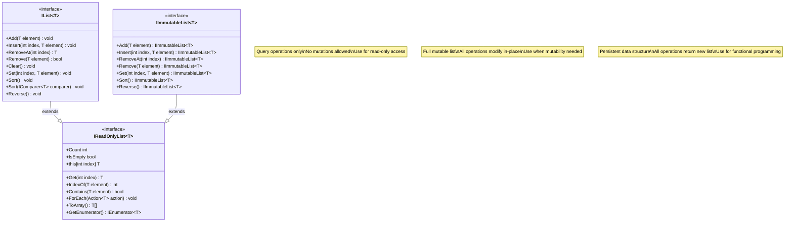
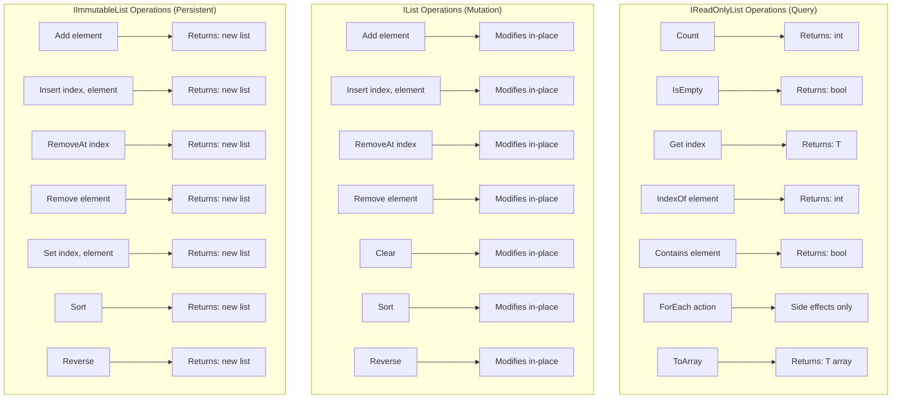

# Exercise 3: IList Interface Specification (O-Interface)

**Interface Type:** O-Interface (Universal/Eternal)
**Version:** 1.0
**Date:** 2025-11-13
**Principle Applied:** "Make interfaces easy to use correctly and hard to use incorrectly"
**Design Goal:** Universal list abstraction that is technology-agnostic, type-safe, and comprehensive

---

## 1. Interface Overview

### Purpose

`IList<T>` and its companion interfaces provide a universal abstraction for ordered collections of elements. This is a *
*TYPE O interface** - it represents a timeless, universal data structure concept that exists independently of any
specific technology or business domain.

### Blood Type Classification

- **TYPE O Interface** - Universal/Eternal
- **Change Drivers:** Rarely changes (list is a universal concept)
- **NOT influenced by:** Business logic, database technology, frameworks
- **Stability:** Highest stability class (like math, algorithms, data structures)

### Design Philosophy

This interface follows the principle "Make interfaces easy to use correctly and hard to use incorrectly" by:

1. **Separation of Concerns:** Read operations separate from write operations (ISP)
2. **Type Safety:** Generic types prevent casting errors
3. **Immutability Options:** Both mutable and immutable variants
4. **Null Safety:** Explicit handling of null elements
5. **Clear Semantics:** Every operation precisely defined
6. **Performance Transparency:** O(1), O(n), O(n log n) documented

---

## 2. Interface Hierarchy



---

## 3. IReadOnlyList<T> Interface (Query Operations)

### Purpose

Provides **query-only access** to a list. Implementations guarantee that the list cannot be modified through this
interface (Interface Segregation Principle).

### Interface Definition

```csharp
using System;
using System.Collections;
using System.Collections.Generic;

namespace UniversalCollections
{
    public interface IReadOnlyList<out T> : IEnumerable<T>
    {
        int Count { get; }
        bool IsEmpty { get; }
        T this[int index] { get; }
        T Get(int index);
        void ForEach(Action<T> action);
        T[] ToArray();
        new IEnumerator<T> GetEnumerator();
    }
}```

---

## 4. IList<T> Interface (Mutable Operations)

### Purpose

Extends `IReadOnlyList<T>` with **mutation operations**. All operations modify the list **in-place**.

### Interface Definition

```csharp
namespace UniversalCollections
{
    public interface IList<T> : IReadOnlyList<T>
    {
        new T this[int index] { get; set; }
        void Set(int index, T element);
        int IndexOf(T element);
        bool Contains(T element);
        void Add(T element);
        void Insert(int index, T element);
        T RemoveAt(int index);
        bool Remove(T element);
        void Clear();
        void Sort();
        void Sort(IComparer<T> comparer);
        void Reverse();
    }
}```

---

## 5. IImmutableList<T> Interface (Persistent Data Structure)

### Purpose

Provides a **persistent** list where all operations return a **new list** instead of modifying the original (functional
programming style).

### Interface Definition

```csharp
namespace UniversalCollections
{
    public interface IImmutableList<T> : IReadOnlyList<T>
    {
        IImmutableList<T> Add(T element);
        IImmutableList<T> Insert(int index, T element);
        IImmutableList<T> RemoveAt(int index);
        IImmutableList<T> Remove(T element);
        IImmutableList<T> Set(int index, T element);
        IImmutableList<T> Sort();
        IImmutableList<T> Sort(IComparer<T> comparer);
        IImmutableList<T> Reverse();
        static IImmutableList<T> Empty { get; }
    }
}```

---

## 6. Supporting Interfaces

### IComparer<T> (Standard .NET)

```csharp
namespace System.Collections.Generic
{
    public interface IComparer<in T>
    {
        int Compare(T x, T y);
    }
}```

---

## 7. Mixed Lists (Heterogeneous Collections)

### Approach: Use Common Base Type

To allow mixed lists (e.g., customers and contracts), use a common base type or interface:

```csharp
public interface IEntity
{
    Guid Id { get; }
    string Name { get; }
}

public class Customer : IEntity
{
    public Guid Id { get; set; }
    public string Name { get; set; }
    public string Email { get; set; }
}

public class Contract : IEntity
{
    public Guid Id { get; set; }
    public string Name { get; set; }
    public decimal Value { get; set; }
}

IList<IEntity> mixedEntities = new ArrayList<IEntity>();
mixedEntities.Add(new Customer { Id = Guid.NewGuid(), Name = "Alice" });
mixedEntities.Add(new Contract { Id = Guid.NewGuid(), Name = "Contract-001" });

foreach (var entity in mixedEntities)
{
    if (entity is Customer customer)
    {
        Console.WriteLine($"Customer: {customer.Email}");
    }
    else if (entity is Contract contract)
    {
        Console.WriteLine($"Contract: {contract.Value}");
    }
}
```

### Option 2: object (Not Recommended)

```csharp
IList<object> mixedList = new ArrayList<object>();
mixedList.Add(new Customer());
mixedList.Add(new Contract());
```

**Recommendation:** Use Option 1 (common interface) for type-safe mixed lists.

---

## 8. Visual Diagram: List Operations



---

## 9. Usage Examples

### Example 1: Read-Only Access

```csharp
public class OrderService
{
    public decimal CalculateTotal(IReadOnlyList<OrderLine> orderLines)
    {
        decimal total = 0;
        orderLines.ForEach(line => total += line.Total);
        return total;
    }
}

```

### Example 2: Mutable List

```csharp
public class ShoppingCart
{
    private readonly IList<Product> _products = new ArrayList<Product>();

    public void AddProduct(Product product)
    {
        _products.Add(product);
    }

    public void RemoveProduct(Product product)
    {
        _products.Remove(product);
    }

    public IReadOnlyList<Product> GetProducts()
    {
        return _products.AsReadOnly();
    }
}
```

### Example 3: Immutable List (Functional Style)

```csharp
public class TaskManager
{
    private IImmutableList<Task> _tasks = ImmutableArrayList<Task>.Empty;

    public void AddTask(Task task)
    {
        _tasks = _tasks.Add(task);
    }

    public void CompleteTask(Task task)
    {
        _tasks = _tasks.Remove(task);
    }

    public IImmutableList<Task> GetTasks()
    {
        return _tasks;
    }
}

```

### Example 4: Sorting

```csharp
IList<int> numbers = new ArrayList<int>(30, 10, 20);

numbers.Sort();

IList<string> names = new ArrayList<string>("Charlie", "alice", "Bob");
names.Sort(StringComparer.OrdinalIgnoreCase);

IImmutableList<int> immutableNumbers = ImmutableArrayList.Create(30, 10, 20);
IImmutableList<int> sorted = immutableNumbers.Sort();
```

### Example 5: Mixed Lists (Type-Safe)

```csharp
public interface ISearchable
{
    string GetSearchText();
}

public class Customer : ISearchable
{
    public string Name { get; set; }
    public string GetSearchText() => Name;
}

public class Product : ISearchable
{
    public string ProductName { get; set; }
    public string GetSearchText() => ProductName;
}

IList<ISearchable> searchableItems = new ArrayList<ISearchable>();
searchableItems.Add(new Customer { Name = "Alice" });
searchableItems.Add(new Product { ProductName = "Coffee" });

public IList<ISearchable> Search(IReadOnlyList<ISearchable> items, string query)
{
    var results = new ArrayList<ISearchable>();
    foreach (var item in items)
    {
        if (item.GetSearchText().Contains(query, StringComparison.OrdinalIgnoreCase))
        {
            results.Add(item);
        }
    }
    return results;
}
```

---

## 10. Performance Characteristics

| Operation      | IList (ArrayList) | IList (LinkedList) | IImmutableList   |
|----------------|-------------------|--------------------|------------------|
| **Get[index]** | O(1)              | O(n)               | O(log n)         |
| **Add**        | Amortized O(1)    | O(1)               | O(log n)         |
| **Insert**     | O(n)              | O(n)               | O(log n)         |
| **RemoveAt**   | O(n)              | O(n)               | O(log n)         |
| **IndexOf**    | O(n)              | O(n)               | O(n)             |
| **Contains**   | O(n)              | O(n)               | O(n)             |
| **Sort**       | O(n log n)        | O(n log n)         | O(n log n)       |
| **Memory**     | Continuous        | Scattered          | Shared structure |

**Key Insights:**

- **ArrayList:** Best for random access, worst for insertions/deletions
- **LinkedList:** Best for insertions/deletions, worst for random access
- **ImmutableList:** Balanced performance, thread-safe, structural sharing

---

## 11. Thread Safety Guarantees

### IReadOnlyList<T>

- **Concurrent reads:** SHOULD be safe (implementation-dependent)
- **Read during write:** NOT guaranteed safe

### IList<T>

- **Concurrent operations:** NOT safe by default
- **Synchronization required:** Use external locks or concurrent collections

### IImmutableList<T>

- **Concurrent reads:** ALWAYS safe (immutable)
- **Concurrent updates:** Safe (each update creates new list)
- **No locks needed:** Thread-safe by design

**Example: Thread-Safe Pattern**

```csharp
IList<int> shared = new ArrayList<int>();
Parallel.For(0, 100, i => shared.Add(i)); // Race condition!

IImmutableList<int> shared = ImmutableArrayList<int>.Empty;
Parallel.For(0, 100, i => {
    Interlocked.Exchange(ref shared, shared.Add(i)); // Thread-safe
});
```

---

## 12. Interface Quality Assessment

### ✅ Strengths

| Criterion                    | Implementation                          | Grade |
|------------------------------|-----------------------------------------|-------|
| **Type Safety**              | Generic T, no object casts              | A+    |
| **Separation of Concerns**   | Read/Write/Immutable separated (ISP)    | A+    |
| **Null Safety**              | Explicit documentation, no null returns | A+    |
| **Clear Semantics**          | Every operation precisely defined       | A+    |
| **Performance Transparency** | O(n) documented for every method        | A+    |
| **Immutability Options**     | Both mutable and immutable variants     | A+    |
| **Thread Safety**            | Clearly documented for each interface   | A+    |
| **Extensibility**            | Generic, works with any type            | A+    |

### ⚠️ Trade-offs

#### Trade-off 1: Three Interfaces vs One

**Decision:** Separate IReadOnlyList, IList, IImmutableList

**Rationale:**

- ✅ Interface Segregation Principle (ISP)
- ✅ Callers specify exact needs (read-only, mutable, immutable)
- ✅ Prevents accidental mutations
- ❌ More interfaces to learn

**Alternative:** Single IList with all operations

- ❌ Violates ISP (read-only clients forced to see write methods)

**Conclusion:** Multiple interfaces better align with ISP principle.

---

#### Trade-off 2: RemoveAt returns element vs void

**Decision:** RemoveAt returns removed element

**Rationale:**

- ✅ Common use case: remove and use element
- ✅ Avoids extra Get call before removal
- ✅ Consistent with stack.Pop(), queue.Dequeue()
- ❌ Different from List<T>.RemoveAt() in .NET

**Alternative:** void RemoveAt(int index)

- ✅ Simpler signature
- ❌ Requires Get before RemoveAt if element needed

**Conclusion:** Returning element is more useful.

---

#### Trade-off 3: Allow null elements vs Forbid

**Decision:** Allow null elements (documented)

**Rationale:**

- ✅ Flexibility (some use cases need null)
- ✅ Consistent with most collections
- ✅ Implementations can override if needed
- ❌ Requires null checks in caller code

**Alternative:** Forbid null (throw ArgumentNullException)

- ✅ Prevents NullReferenceException
- ❌ Too restrictive for some use cases

**Conclusion:** Allow null, document clearly.

---

## 13. Compliance with Principles

### Principle: "Make interfaces easy to use correctly and hard to use incorrectly"

| Aspect                   | Grade | Evidence                                  |
|--------------------------|-------|-------------------------------------------|
| Type Safety              | A+    | Generic T prevents casting errors         |
| Separation of Concerns   | A+    | Read/Write/Immutable separated (ISP)      |
| Null Safety              | A     | Null allowed but documented               |
| Clear Semantics          | A+    | Every operation precisely defined         |
| Performance Transparency | A+    | O(n) documented for every method          |
| Thread Safety            | A+    | Explicitly documented per interface       |
| Immutability             | A+    | IImmutableList for functional programming |

**Overall Grade: A+**

---

## 14. References

### Standards

- **SOLID Principles** (Interface Segregation Principle)
- **Domain-Driven Design** (Value Objects, Aggregates)
- **.NET Collection Interfaces** (IEnumerable, ICollection, IList)
- **Functional Programming** (Persistent Data Structures)

### Sources

- **THE SOFTWARE ENGINEERING BIBLE.md** (Section: O-Interface Design)
- **ArchitectureForAI.md** (Blood Type Separation)
- **Effective C#** (Bill Wagner, Item 30: Prefer IEnumerable)
- **Purely Functional Data Structures** (Chris Okasaki)

---

**Document Status:** FINAL
**Interface Type:** O-Interface (Universal/Eternal)
**Compliance:** Fully compliant with "Make interfaces easy to use correctly and hard to use incorrectly" principle
**Quality Rating:** A+ (Exemplary universal interface design)
